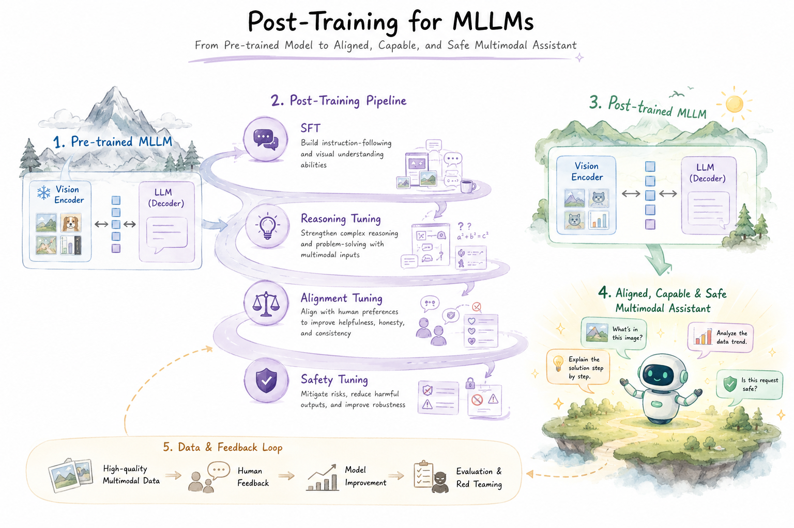

# Awesome Post-Training for Multimodal Large Language Models
> A rigorous and systematically organized survey repository on post-training methodologies for **Multimodal Large Language Models (MLLMs)**, covering instruction tuning, alignment learning, reasoning enhancement, domain adaptation, scalable training, and multimodal evaluation.

This repository accompanies the survey **A Survey on Post-training of Multimodal Large Language Models** and provides a structured literature map for understanding how post-training transforms pre-trained MLLMs into aligned, capable, and safe multimodal assistants. Following the survey's behavior-shaping perspective, MLLM post-training is not merely a downstream optimization stage; it is a systematic process that calibrates broad cross-modal representations toward reliable instruction following, preference alignment, complex reasoning, domain-aware adaptation, and scalable multimodal learning.

As illustrated in the framework below, the post-training pipeline begins with a pre-trained multimodal substrate composed of a vision encoder and an LLM decoder. It then progressively refines the model through supervised instruction tuning, reasoning-oriented tuning, alignment tuning, and safety-oriented tuning, while being continuously improved through high-quality multimodal data, human or AI feedback, evaluation, and red-teaming loops. This organization reflects the central thesis of the survey: robust MLLMs emerge from an iterative interaction between multimodal data, feedback signals, optimization algorithms, and evaluation protocols.

<p align="center">
  
</p>

---

## &#128204; Contents

| Section | Subsection |
| --- | --- |
| [&#129302; Multimodal Instruction Tuning](#multimodal-instruction-tuning) | [Representative Papers](#multimodal-instruction-tuning-papers) |
| [&#127942; Multimodal Alignment Learning](#multimodal-alignment-learning) | [Multimodal RLHF](#multimodal-rlhf), [Multimodal RLAIF](#multimodal-rlaif), [Multimodal Direct Preference Optimization](#multimodal-direct-preference-optimization) |
| [&#128640; Multimodal Reasoning Enhancement](#multimodal-reasoning-enhancement) | [R1-based Multimodal Reasoning](#r1-based-multimodal-reasoning), [Thinking with Images](#thinking-with-images), [Multimodal Self-Evolving](#multimodal-self-evolving), [Multimodal Distillation](#multimodal-distillation) |
| [&#129517; Multimodal Domain Adaptation](#multimodal-domain-adaptation) | Domain-oriented post-training for specialized multimodal scenarios |
| [&#9881;&#65039; Multimodal Scalable Training](#multimodal-scalable-training) | [LoRA-based Methods](#lora-based-methods), [MoE-based Methods](#moe-based-methods), [Compute-efficient Methods](#compute-efficient-methods) |
| [&#128202; Multimodal Benchmarks](#multimodal-benchmarks) | Benchmarks, evaluation protocols, and capability taxonomies |

---

# &#128214; Papers

<a id="multimodal-instruction-tuning"></a>
## &#129302; Multimodal Instruction Tuning

Multimodal instruction tuning constitutes one of the earliest and most fundamental post-training paradigms for MLLMs. Its primary objective is to transform broad visual-language representations into instruction-following behavior by training on multimodal instruction-response data. This paradigm establishes the interface between user intent, multimodal input, and model output, thereby enabling MLLMs to respond to image-, video-, audio-, or interleaved multimodal prompts in a task-oriented manner.

The development of this line of research begins with representative systems such as LLaVA, MiniGPT-4, InstructBLIP, and mPLUG-Owl, which demonstrate the effectiveness of combining a visual encoder, a large language model, and curated instruction data. Subsequent studies extend this recipe toward higher-resolution perception, multi-image and video understanding, mobile deployment, visual prompt comprehension, data selection, mixture-of-experts adaptation, and generalized multimodal task transfer.

<a id="multimodal-instruction-tuning-papers"></a>
### Multimodal Instruction Tuning Papers

| # | Method | Type | Venue | Resources |
|---:|---|---|---|---|
| 1 | [LLaVA](https://arxiv.org/pdf/2304.08485) | Article | arXiv  | [Paper](https://arxiv.org/pdf/2304.08485) / [Code](https://github.com/haotian-liu/LLaVA) / [Project](https://llava-vl.github.io/) |
| 2 | [MiniGPT-4](https://arxiv.org/pdf/2304.10592) | Article | arXiv  | [Paper](https://arxiv.org/pdf/2304.10592) / [Code](https://github.com/Vision-CAIR/MiniGPT-4) / [Project](https://minigpt-4.github.io/) |
| 3 | [InstructBLIP](https://arxiv.org/pdf/2305.06500) | Article | arXiv  | [Paper](https://arxiv.org/pdf/2305.06500) / [Code](https://github.com/salesforce/LAVIS/tree/main/projects/instructblip) |
| 4 | [mPLUG-Owl](https://arxiv.org/pdf/2304.14178) | Article | arXiv  | [Paper](https://arxiv.org/pdf/2304.14178) / [Code](https://github.com/X-PLUG/mPLUG-Owl) |
| 5 | [LLaMA-Adapter V2](https://arxiv.org/pdf/2304.15010) | Article | arXiv  | [Paper](https://arxiv.org/pdf/2304.15010) / [Code](https://github.com/OpenGVLab/LLaMA-Adapter) |
| 6 | [LLaVA-1.5](https://arxiv.org/pdf/2310.03744) | Article | arXiv  | [Paper](https://arxiv.org/pdf/2310.03744) / [Code](https://github.com/haotian-liu/LLaVA) / [Project](https://llava-vl.github.io/) |
| 7 | [Qwen-VL-Chat](https://arxiv.org/pdf/2308.12966) | Article | arXiv  | [Paper](https://arxiv.org/pdf/2308.12966) / [Code](https://github.com/QwenLM/Qwen-VL) |
| 8 | [CogVLM](https://arxiv.org/pdf/2311.03079) | Article | arXiv  | [Paper](https://arxiv.org/pdf/2311.03079) / [Code](https://github.com/THUDM/CogVLM) |
| 9 | [InternVL-Chat](https://arxiv.org/pdf/2312.14238) | Article | arXiv  | [Paper](https://arxiv.org/pdf/2312.14238) / [Code](https://github.com/OpenGVLab/InternVL) |
| 10 | LLaVA-NeXT | Model | - | [Code](https://github.com/LLaVA-VL/LLaVA-NeXT) / [Project](https://llava-vl.github.io/blog/2024-01-30-llava-next/) |
| 11 | [Idefics2](https://arxiv.org/pdf/2405.02246) | Article | arXiv  | [Paper](https://arxiv.org/pdf/2405.02246) / [HF](https://huggingface.co/blog/idefics2) |
| 12 | [Qwen2-VL-Instruct](https://arxiv.org/pdf/2409.12191) | Article | arXiv  | [Paper](https://arxiv.org/pdf/2409.12191) / [Code](https://github.com/QwenLM/Qwen2-VL) |
| 13 | [LLaVA-OneVision](https://arxiv.org/pdf/2408.03326) | Article | arXiv  | [Paper](https://arxiv.org/pdf/2408.03326) / [Code](https://github.com/LLaVA-VL/LLaVA-NeXT/blob/main/docs/LLaVA_OneVision.md) / [Project](https://llava-vl.github.io/blog/2024-08-05-llava-onevision/) |
| 14 | [InternVL2.5](https://arxiv.org/pdf/2412.05271) | Article | arXiv  | [Paper](https://arxiv.org/pdf/2412.05271) / [Code](https://github.com/OpenGVLab/InternVL) / [Project](https://internvl.github.io/blog/2024-12-05-InternVL-2.5/) |
| 15 | [Qwen2.5-VL-Instruct](https://arxiv.org/pdf/2502.13923) | Article | arXiv  | [Paper](https://arxiv.org/pdf/2502.13923) / [Code](https://github.com/QwenLM/Qwen2.5-VL) |
| 16 | [VILA](https://arxiv.org/pdf/2312.07533) | Article | arXiv  | [Paper](https://arxiv.org/pdf/2312.07533) / [Code](https://github.com/NVlpdf/VILA) |
| 17 | [MobileVLM](https://arxiv.org/pdf/2312.16886) | Article | arXiv  | [Paper](https://arxiv.org/pdf/2312.16886) / [Code](https://github.com/Meituan-AutoML/MobileVLM) |
| 18 | [DeepSeek-VL](https://arxiv.org/pdf/2403.05525) | Article | arXiv  | [Paper](https://arxiv.org/pdf/2403.05525) / [Code](https://github.com/deepseek-ai/DeepSeek-VL) |
| 19 | [Yi-VL](https://arxiv.org/pdf/2403.04652) | Article | arXiv  | [Paper](https://arxiv.org/pdf/2403.04652) / [Code](https://github.com/01-ai/Yi) / [HF](https://huggingface.co/01-ai/Yi-VL-6B) |
| 20 | [Cambrian-1](https://arxiv.org/pdf/2406.16860) | Article | arXiv  | [Paper](https://arxiv.org/pdf/2406.16860) / [Code](https://github.com/cambrian-mllm/cambrian) / [Project](https://cambrian-mllm.github.io/) |
| 21 | [MiniCPM-V2.6](https://arxiv.org/pdf/2408.01800) | Article | arXiv  | [Paper](https://arxiv.org/pdf/2408.01800) / [Code](https://github.com/OpenBMB/MiniCPM-V) / [Project](https://huggingface.co/openbmb/MiniCPM-V-2_6) |
| 22 | [Phi-3.5-Vision-Instruct](https://arxiv.org/pdf/2404.14219) | Article | arXiv  | [Paper](https://arxiv.org/pdf/2404.14219) / [HF](https://huggingface.co/microsoft/Phi-3.5-vision-instruct) |
| 23 | Llama-3.2-Vision-Instruct | Model | - | [HF](https://huggingface.co/meta-llama/Llama-3.2-11B-Vision-Instruct) |
| 24 | [Molmo](https://arxiv.org/pdf/2409.17146) | Article | arXiv  | [Paper](https://arxiv.org/pdf/2409.17146) / [Code](https://github.com/allenai/molmo) / [Project](https://molmo.allenai.org/) |
| 25 | [Pixtral-12B](https://arxiv.org/pdf/2410.07073) | Article | arXiv  | [Paper](https://arxiv.org/pdf/2410.07073) / [Project](https://mistral.ai/news/pixtral-12b) |
| 26 | [CaD-VI](https://arxiv.org/pdf/2406.09240) | Article | arXiv  | [Paper](https://arxiv.org/pdf/2406.09240) / [Code](https://github.com/wlin-at/CaD-VI) / [Project](https://wlin-at.github.io/cad_vi) / [HF](https://huggingface.co/datasets/wlin21at/CaD-Inst) |
| 27 | [PaliGemma](https://arxiv.org/pdf/2407.07726) | Article | arXiv  | [Paper](https://arxiv.org/pdf/2407.07726) / [HF](https://huggingface.co/google/paligemma-3b-mix-224) |
| 28 | [Otter](https://arxiv.org/pdf/2305.03726) | Article | arXiv  | [Paper](https://arxiv.org/pdf/2305.03726) / [Code](https://github.com/Luodian/Otter) |
| 29 | [LLaMA-Adapter](https://arxiv.org/pdf/2303.16199) | Article | arXiv  | [Paper](https://arxiv.org/pdf/2303.16199) / [Code](https://github.com/OpenGVLab/LLaMA-Adapter) |
| 30 | [LaVIN](https://arxiv.org/pdf/2305.15023) | Article | arXiv  | [Paper](https://arxiv.org/pdf/2305.15023) / [Code](https://github.com/luogen1996/LaVIN) |
| 31 | [Valley](https://arxiv.org/pdf/2306.07207) | Article | arXiv  | [Paper](https://arxiv.org/pdf/2306.07207) / [Code](https://github.com/RupertLuo/Valley) |
| 32 | [NExT-GPT](https://arxiv.org/pdf/2309.05519) | Article | arXiv  | [Paper](https://arxiv.org/pdf/2309.05519) / [Code](https://github.com/NExT-GPT/NExT-GPT) / [Project](https://next-gpt.github.io/) |
| 33 | [InternVL-1.0](https://arxiv.org/pdf/2312.14238) | Article | arXiv  | [Paper](https://arxiv.org/pdf/2312.14238) / [Code](https://github.com/OpenGVLab/InternVL) |
| 34 | [GenLLaVA](https://arxiv.org/pdf/2406.11262) | Article | arXiv  | [Paper](https://arxiv.org/pdf/2406.11262) / [Code](https://github.com/jeffhernandez1995/GenLlaVA) |
| 35 | [MLAN](https://arxiv.org/pdf/2411.10557) | Article | arXiv  | [Paper](https://arxiv.org/pdf/2411.10557) |
| 36 | [Inst-IT](https://arxiv.org/pdf/2412.03565) | Article | arXiv  | [Paper](https://arxiv.org/pdf/2412.03565) / [Code](https://github.com/inst-it/inst-it) / [Project](https://inst-it.github.io/) |
| 37 | [L2T](https://arxiv.org/pdf/2503.22215) | Article | arXiv  | [Paper](https://arxiv.org/pdf/2503.22215) / [Code](https://github.com/Feng-Hong/L2T) |
| 38 | [COMPACT](https://arxiv.org/pdf/2504.21850) | Article | arXiv  | [Paper](https://arxiv.org/pdf/2504.21850) / [Code](https://github.com/princetonvisualai/compact) / [Project](https://princetonvisualai.github.io/compact/) |
| 39 | [Vittle](https://arxiv.org/pdf/2505.13946) | Article | arXiv  | [Paper](https://arxiv.org/pdf/2505.13946) / [Code](https://github.com/deeplearning-wisc/vittle) |
| 40 | [LLaDA-V](https://arxiv.org/pdf/2505.16933) | Article | arXiv  | [Paper](https://arxiv.org/pdf/2505.16933) / [Code](https://ml-gsai.github.io/LLaDA-V-demo/) / [Project](https://ml-gsai.github.io/LLaDA-V-demo/) |
| 41 | [GDO](https://arxiv.org/pdf/2603.12478) | Article | arXiv  | [Paper](https://arxiv.org/pdf/2603.12478) / [Code](https://github.com/rujiewu/GDO) |
| 42 | [LLaVA-NeXT-Interleave](https://arxiv.org/pdf/2407.07895) | Article | arXiv  | [Paper](https://arxiv.org/pdf/2407.07895) / [Code](https://github.com/LLaVA-VL/LLaVA-NeXT) / [Project](https://llava-vl.github.io/blog/2024-06-16-llava-next-interleave/) |
| 43 | [MAVIS](https://arxiv.org/pdf/2407.08739) | Article | arXiv  | [Paper](https://arxiv.org/pdf/2407.08739) / [Code](https://github.com/ZrrSkywalker/MAVIS) |
| 44 | [Mantis-Idefics2](https://arxiv.org/pdf/2405.01483) | Article | arXiv  | [Paper](https://arxiv.org/pdf/2405.01483) / [Code](https://github.com/OpenGVLab/LLaMA-Adapter/tree/main/imagebind_LLM) / [Project](https://tiger-ai-lab.github.io/Mantis/) |
| 45 | [ImageBind-LLM](https://arxiv.org/pdf/2309.03905) | Article | arXiv  | [Paper](https://arxiv.org/pdf/2309.03905) / [Code](https://github.com/OpenGVLab/LLaMA-Adapter/tree/main/imagebind_LLM) |
| 46 | [ShareGPT4V](https://arxiv.org/pdf/2311.12793) | Article | arXiv  | [Paper](https://arxiv.org/pdf/2311.12793) / [Code](https://github.com/ShareGPT4Omni/ShareGPT4V) / [Project](https://sharegpt4v.github.io/) |
| 47 | [MiniGPT-v2](https://arxiv.org/pdf/2310.09478) | Article | arXiv  | [Paper](https://arxiv.org/pdf/2310.09478) / [Code](https://github.com/Vision-CAIR/MiniGPT-4) / [Project](https://minigpt-v2.github.io/) |
| 48 | [ViP-LLaVA](https://arxiv.org/pdf/2312.00784) | Article | arXiv  | [Paper](https://arxiv.org/pdf/2312.00784) / [Code](https://github.com/WisconsinAIVision/ViP-LLaVA) / [Project](https://vip-llava.github.io/) |
| 49 | [MoAI](https://arxiv.org/pdf/2403.07508) | Article | arXiv  | [Paper](https://arxiv.org/pdf/2403.07508) / [Code](https://github.com/ByungKwanLee/MoAI) |
| 50 | [Monkey](https://arxiv.org/pdf/2311.06607) | Article | arXiv  | [Paper](https://arxiv.org/pdf/2311.06607) / [Code](https://github.com/Yuliang-Liu/Monkey) |
| 51 | [Mini-Gemini](https://arxiv.org/pdf/2403.18814v1) | Article | arXiv  | [Paper](https://arxiv.org/pdf/2403.18814v1) / [Code](https://github.com/JIA-Lab-research/MGM) |
| 52 | [LLaVA-HR](https://arxiv.org/pdf/2403.03003) | Article | arXiv  | [Paper](https://arxiv.org/pdf/2403.03003) / [Code](https://github.com/luogen1996/LLaVA-HR) |
| 53 | [SPHINX](https://arxiv.org/pdf/2311.07575) | Article | arXiv  | [Paper](https://arxiv.org/pdf/2311.07575) / [Code](https://github.com/Alpha-VLLM/LLaMA2-Accessory) |

---

<a id="multimodal-alignment-learning"></a>
## &#127942; Multimodal Alignment Learning

Multimodal alignment learning aims to make MLLM outputs consistent with human preferences, factual evidence, safety requirements, and cross-modal semantic constraints. Compared with text-only alignment, multimodal alignment must additionally address visual hallucination, fine-grained localization errors, temporal inconsistency in videos, modality conflicts, and heterogeneous feedback granularity. The literature can be organized into three major paradigms: reinforcement learning from human feedback, reinforcement learning from AI feedback, and direct preference optimization.

<a id="multimodal-rlhf"></a>
### Multimodal RLHF

Multimodal RLHF introduces human feedback or human-derived reward signals to guide MLLMs toward more factual, helpful, and preference-aligned behavior. Existing methods construct reward models at different levels of granularity, including pair-level, span-level, step-level, and mixed-level feedback. Optimization procedures such as PPO, DDPO, process reward modeling, best-of-N sampling, reject sampling, and multi-objective reinforcement learning are used to improve alignment over image and video contexts.

| # | Method | Type | Venue | Resources |
|---:|---|---|---|---|
| 1 | [LLaVA-RLHF](https://arxiv.org/pdf/2309.14525) | Article | arXiv  | [Paper](https://arxiv.org/pdf/2309.14525) / [Code](https://github.com/llava-rlhf/LLaVA-RLHF) / [Project](https://llava-rlhf.github.io/) |
| 2 | [RLHF-V](https://arxiv.org/pdf/2312.00849) | Article | arXiv  | [Paper](https://arxiv.org/pdf/2312.00849) / [Code](https://github.com/RLHF-V/RLHF-V) / [Project](https://rlhf-v.github.io/) |
| 3 | [VisualPRM](https://arxiv.org/pdf/2503.10291) | Article | arXiv  | [Paper](https://arxiv.org/pdf/2503.10291) / [Project](https://internvl.github.io/blog/2025-03-13-VisualPRM/) |
| 4 | [Gemini](https://arxiv.org/pdf/2312.11805) | Article | arXiv  | [Paper](https://arxiv.org/pdf/2312.11805) / [Project](https://deepmind.google/technologies/gemini/) |
| 5 | [Seed1.5-VL](https://arxiv.org/pdf/2505.07062) | Article | arXiv  | [Paper](https://arxiv.org/pdf/2505.07062) / [Code](https://github.com/ByteDance-Seed/Seed1.5-VL) / [Project](https://seed.bytedance.com/en/tech/seed1_5_vl) |
| 6 | [MiMo-VL](https://arxiv.org/pdf/2506.03569) | Article | arXiv  | [Paper](https://arxiv.org/pdf/2506.03569) / [Code](https://github.com/XiaomiMiMo/MiMo-VL) |

<a id="multimodal-rlaif"></a>
### Multimodal RLAIF

Multimodal RLAIF reduces the cost and scalability limitations of human feedback by using stronger models, automatic evaluators, or structured AI feedback as supervisory signals. This paradigm is particularly valuable for video understanding, large-scale preference construction, and iterative alignment settings. Representative work explores context-aware reward modeling, open-source AI feedback, preference distillation, and iterative refinement for improving trustworthiness and alignment quality.

| # | Method | Type | Venue | Resources |
|---:|---|---|---|---|
| 1 | [VLM-RLAIF](https://arxiv.org/pdf/2402.03746) | Article | arXiv  | [Paper](https://arxiv.org/pdf/2402.03746) / [Code](https://github.com/yonseivnl/vlm-rlaif) / [Project](https://dcahn12.github.io/projects/vlm-rlaif/) |
| 2 | [RLAIF-V](https://arxiv.org/pdf/2405.17220) | Article | arXiv  | [Paper](https://arxiv.org/pdf/2405.17220) / [Code](https://github.com/RLHF-V/RLAIF-V) |
| 3 | [Oracle-RLAIF](https://arxiv.org/abs/2510.02561) | Article | arXiv  | [Paper](https://arxiv.org/abs/2510.02561) |

<a id="multimodal-direct-preference-optimization"></a>
### Multimodal Direct Preference Optimization

Multimodal Direct Preference Optimization directly optimizes model policies from preference data without relying on an explicitly trained reward model. This family of methods is especially useful for mitigating multimodal hallucination, object-level inconsistency, modality-level conflict, and response-level preference errors. Recent work further extends DPO toward conditional preference objectives, vision-guided preference construction, difficulty-aware sampling, uncertainty-aware exploration, and on-policy data generation.

| # | Method | Type | Venue | Resources |
|---:|---|---|---|---|
| 1 | [Silkie](https://arxiv.org/pdf/2312.10665) | Article | arXiv  | [Paper](https://arxiv.org/pdf/2312.10665) / [Code](https://github.com/vlf-silkie/VLFeedback) / [Project](https://vlf-silkie.github.io/) |
| 2 | [Video-DPO](https://arxiv.org/pdf/2404.01258) | Article | arXiv  | [Paper](https://arxiv.org/pdf/2404.01258) / [Code](https://github.com/RifleZhang/LLaVA-Hound-DPO) |
| 3 | [ISR-DPO](https://arxiv.org/pdf/2406.11280) | Article | arXiv  | [Paper](https://arxiv.org/pdf/2406.11280) / [Code](https://github.com/snumprlab/isr-dpo) / [Project](https://dcahn12.github.io/projects/isr-dpo/) |
| 4 | [HA-DPO](https://arxiv.org/pdf/2311.16839) | Article | arXiv  | [Paper](https://arxiv.org/pdf/2311.16839) / [Code](https://github.com/opendatalab/HA-DPO) / [Project](https://opendatalab.github.io/HA-DPO/) |
| 5 | [HDPO](https://arxiv.org/pdf/2411.10436) | Article | arXiv  | [Paper](https://arxiv.org/pdf/2411.10436) |
| 6 | [V-DPO](https://arxiv.org/pdf/2411.02712) | Article | arXiv  | [Paper](https://arxiv.org/pdf/2411.02712) / [Code](https://github.com/YuxiXie/V-DPO) |
| 7 | [CLIP-DPO](https://arxiv.org/pdf/2408.10433) | Article | arXiv  | [Paper](https://arxiv.org/pdf/2408.10433) |
| 8 | [CHAIR-DPO](https://arxiv.org/pdf/2508.20181) | Article | arXiv  | [Paper](https://arxiv.org/pdf/2508.20181) / [Code](https://github.com/aimagelab/CHAIR-DPO) |
| 9 | [mDPO](https://arxiv.org/pdf/2406.11839) | Article | arXiv  | [Paper](https://arxiv.org/pdf/2406.11839) / [Code](https://github.com/luka-group/mDPO) / [Project](https://feiwang96.github.io/mDPO/) |
| 10 | PEA-DPO | Model | - | [Project](https://openreview.net/forum?id=uZ5AmOJKqV) |
| 11 | [MoD-DPO](https://arxiv.org/pdf/2603.03192) | Article | arXiv  | [Paper](https://arxiv.org/pdf/2603.03192) / [Project](https://mod-dpo.github.io/) |
| 12 | [OmniDPO](https://arxiv.org/pdf/2509.00723) | Article | arXiv  | [Paper](https://arxiv.org/pdf/2509.00723) |
| 13 | [DA-DPO](https://arxiv.org/pdf/2601.00623) | Article | arXiv  | [Paper](https://arxiv.org/pdf/2601.00623) / [Code](https://github.com/Artanic30/DA-DPO) / [Project](https://artanic30.github.io/project_pages/DA-DPO/) |
| 14 | [UE-DPO](https://arxiv.org/pdf/2605.04874) | Article | arXiv  | [Paper](https://arxiv.org/pdf/2605.04874) |
| 15 | [OPA-DPO](https://arxiv.org/pdf/2501.09695) | Article | arXiv  | [Paper](https://arxiv.org/pdf/2501.09695) / [Code](https://github.com/zhyang2226/OPA-DPO) / [Project](https://opa-dpo.github.io/) |
| 16 | [LPOI](https://arxiv.org/pdf/2505.21061) | Article | arXiv  | [Paper](https://arxiv.org/pdf/2505.21061) / [Code](https://github.com/fatemehpesaran310/lpoi) |

---

<a id="multimodal-reasoning-enhancement"></a>
## &#128640; Multimodal Reasoning Enhancement

Multimodal reasoning enhancement focuses on strengthening the ability of MLLMs to solve complex tasks that require visual evidence, symbolic reasoning, spatial-temporal understanding, tool use, grounding, and multi-step inference. This research direction has rapidly expanded with the emergence of R1-style reinforcement learning, visually grounded reasoning, self-evolving training loops, and distillation-based capability transfer.

<a id="r1-based-multimodal-reasoning"></a>
### R1-based Multimodal Reasoning

R1-based multimodal reasoning adapts reinforcement learning strategies inspired by R1-style reasoning models to vision-language and omni-modal settings. These methods typically optimize verifiable objectives such as answer correctness, reasoning format, visual grounding, or process-level reward. By reducing dependence on manually annotated reasoning traces, they provide a scalable route for improving mathematical reasoning, chart understanding, video reasoning, retrieval, and general multimodal problem solving.

| # | Method | Type | Venue | Resources |
|---:|---|---|---|---|
| 1 | [LMM-R1](https://arxiv.org/abs/2503.07536) | Article | arXiv  | [Paper](https://arxiv.org/abs/2503.07536) |
| 2 | [VLM-R1](https://arxiv.org/abs/2504.07615) | Article | arXiv  | [Paper](https://arxiv.org/abs/2504.07615) / [Code](https://github.com/om-ai-lab/VLM-R1) |
| 3 | [Visual-RFT](https://arxiv.org/abs/2503.01785) | Article | arXiv  | [Paper](https://arxiv.org/abs/2503.01785) / [Code](https://github.com/Liuziyu77/Visual-RFT) |
| 4 | [Vision-R1](https://arxiv.org/abs/2503.06749) | Article | arXiv  | [Paper](https://arxiv.org/abs/2503.06749) / [Code](https://github.com/Osilly/Vision-R1) |
| 5 | [VideoChat-R1](https://arxiv.org/abs/2504.06958) | Article | arXiv  | [Paper](https://arxiv.org/abs/2504.06958) / [Code](https://github.com/OpenGVLab/VideoChat-R1) |
| 6 | [Video-R1](https://arxiv.org/abs/2503.21776) | Article | arXiv  | [Paper](https://arxiv.org/abs/2503.21776) / [Code](https://github.com/tulerfeng/Video-R1) |
| 7 | [VisualPRM](https://arxiv.org/pdf/2503.10291) | Article | arXiv  | [Paper](https://arxiv.org/pdf/2503.10291) / [Project](https://internvl.github.io/blog/2025-03-13-VisualPRM/) |
| 8 | [R1-VL](https://arxiv.org/abs/2503.12937) | Article | arXiv  | [Paper](https://arxiv.org/abs/2503.12937) |
| 9 | [VisualThinker-R1-Zero](https://arxiv.org/abs/2503.05132) | Article | arXiv  | [Paper](https://arxiv.org/abs/2503.05132) / [Code](https://github.com/turningpoint-ai/VisualThinker-R1-Zero) |
| 10 | [MM-Eureka](https://arxiv.org/abs/2503.07365) | Article | arXiv  | [Paper](https://arxiv.org/abs/2503.07365) / [Code](https://github.com/ModalMinds/MM-EUREKA) / [HF](https://huggingface.co/FanqingM/MM-Eureka-8B) |
| 11 | [R1-Onevision](https://arxiv.org/abs/2503.10615) | Article | arXiv  | [Paper](https://arxiv.org/abs/2503.10615) / [Code](https://github.com/Fancy-MLLM/R1-onevision) |
| 12 | [R1-Omni](https://arxiv.org/abs/2503.05379) | Article | arXiv  | [Paper](https://arxiv.org/abs/2503.05379) / [Code](https://github.com/HumanMLLM/R1-Omni) |
| 13 | [Retrv-R1](https://arxiv.org/abs/2510.02745) | Article | arXiv  | [Paper](https://arxiv.org/abs/2510.02745) / [Code](https://lanyunzhu.site/RetrvR1/) / [Project](https://lanyunzhu.site/RetrvR1/) |

<a id="thinking-with-images"></a>
### Thinking with Images

Thinking with Images emphasizes explicit use of visual evidence during the reasoning process. Instead of compressing images into implicit context alone, these methods encourage models to reason over regions, points, crops, visual tools, latent visual structures, or grounded intermediate representations. This paradigm is crucial for tasks that require localization, visual planning, fine-grained perception, and tool-augmented multimodal reasoning.

| # | Method | Type | Venue | Resources |
|---:|---|---|---|---|
| 1 | [GRIT](https://arxiv.org/abs/2505.15879) | Article | arXiv  | [Paper](https://arxiv.org/abs/2505.15879) / [Code](https://github.com/eric-ai-lab/GRIT) / [Project](https://grounded-reasoning.github.io/) |
| 2 | [Point-RFT](https://arxiv.org/abs/2505.19702) | Article | arXiv  | [Paper](https://arxiv.org/abs/2505.19702) |
| 3 | [OpenThinkIMG](https://arxiv.org/abs/2505.08617) | Article | arXiv  | [Paper](https://arxiv.org/abs/2505.08617) / [Code](https://github.com/OpenThinkIMG/OpenThinkIMG) / [HF](https://huggingface.co/collections/Warrieryes/openthinkimg) |
| 4 | [VisionReasoner](https://arxiv.org/abs/2505.12081) | Article | arXiv  | [Paper](https://arxiv.org/abs/2505.12081) / [Code](https://github.com/dvlab-research/VisionReasoner) |
| 5 | [DeepEyes](https://arxiv.org/abs/2505.14362) | Article | arXiv  | [Paper](https://arxiv.org/abs/2505.14362) / [Code](https://github.com/Visual-Agent/DeepEyes) / [HF](https://huggingface.co/ChenShawn/DeepEyes-7B) |
| 6 | [VTool-R1](https://arxiv.org/abs/2505.19255) | Article | arXiv  | [Paper](https://arxiv.org/abs/2505.19255) / [Code](https://github.com/VTOOL-R1/vtool-r1) / [Project](https://vtool-r1.github.io/) |
| 7 | [VisualPlanning](https://arxiv.org/abs/2505.11409) | Article | arXiv  | [Paper](https://arxiv.org/abs/2505.11409) / [Code](https://github.com/yix8/VisualPlanning) |
| 8 | [LanteRn](https://arxiv.org/abs/2603.25629) | Article | arXiv  | [Paper](https://arxiv.org/abs/2603.25629) / [Code](https://github.com/GuilhermeViveiros/LantErn) / [HF](https://huggingface.co/AGViveiros/LanteRn-3B-RL) |

<a id="multimodal-self-evolving"></a>
### Multimodal Self-Evolving

Multimodal self-evolving methods study how MLLMs can improve through iterative loops of self-generated data, self-correction, critique, reflection, or unsupervised post-training. Rather than relying exclusively on static supervised datasets, these methods treat the model as both a learner and a data or feedback generator. This closed-loop formulation is particularly relevant for data-scarce, dynamically changing, or open-ended multimodal tasks.

| # | Method | Type | Venue | Resources |
|---:|---|---|---|---|
| 1 | [VIGC](https://arxiv.org/abs/2308.12714) | Article | arXiv  | [Paper](https://arxiv.org/abs/2308.12714) / [Code](https://github.com/opendatalab/VIGC) / [Project](https://opendatalab.github.io/VIGC) |
| 2 | [MindGYM](https://arxiv.org/abs/2503.09499) | Article | arXiv  | [Paper](https://arxiv.org/abs/2503.09499) / [Code](https://github.com/modelscope/data-juicer/tree/MindGYM) |
| 3 | [SRPO](https://arxiv.org/abs/2506.01713) | Article | arXiv  | [Paper](https://arxiv.org/abs/2506.01713) / [Code](https://github.com/SUSTechBruce/SRPO_MLLMs) / [Project](https://srpo.pages.dev/) |
| 4 | [LLaVA-Critic](https://arxiv.org/pdf/2410.02712) | Article | arXiv  | [Paper](https://arxiv.org/pdf/2410.02712) / [Code](https://github.com/LLaVA-VL/LLaVA-NeXT) / [Project](https://llava-vl.github.io/blog/2024-10-03-llava-critic/) |
| 5 | [MM-UPT](https://arxiv.org/abs/2505.22453) | Article | arXiv  | [Paper](https://arxiv.org/abs/2505.22453) / [Code](https://github.com/waltonfuture/MM-UPT) / [HF](https://huggingface.co/WaltonFuture/Qwen2.5-VL-7B-MM-UPT-MMR1) |
| 6 | [LLaVA-Critic-R1](https://arxiv.org/abs/2509.00676) | Article | arXiv  | [Paper](https://arxiv.org/abs/2509.00676) / [Code](https://github.com/LLaVA-VL/LLaVA-NeXT) |

<a id="multimodal-distillation"></a>
### Multimodal Distillation

Multimodal distillation transfers capabilities from stronger teacher models, preference models, or on-policy trajectories into smaller, more efficient, or more specialized student models. Beyond conventional compression, this paradigm also supports capability alignment: the student model is expected to preserve fine-grained visual perception, temporal grounding, multimodal reasoning, and cross-modal response quality. Recent work highlights on-policy distillation as an important mechanism for combining efficiency with robust multimodal capability transfer.

| # | Method | Type | Venue | Resources |
|---:|---|---|---|---|
| 1 | [LLaVA-KD](https://arxiv.org/abs/2410.16236) | Article | arXiv  | [Paper](https://arxiv.org/abs/2410.16236) / [Code](https://github.com/Fantasyele/LLaVA-KD) |
| 2 | [LLAVADI](https://arxiv.org/abs/2407.19409) | Article | arXiv  | [Paper](https://arxiv.org/abs/2407.19409) |
| 3 | [LLaVA-MoD](https://arxiv.org/abs/2408.15881) | Article | arXiv  | [Paper](https://arxiv.org/abs/2408.15881) / [Code](https://github.com/shufangxun/LLaVA-MoD) |
| 4 | [Video-OPD](https://arxiv.org/abs/2602.02994) | Article | arXiv  | [Paper](https://arxiv.org/abs/2602.02994) |
| 5 | [X-OPD](https://arxiv.org/abs/2603.24596) | Article | arXiv  | [Paper](https://arxiv.org/abs/2603.24596) |
| 6 | [Uni-OPD](https://arxiv.org/abs/2605.03677) | Article | arXiv  | [Paper](https://arxiv.org/abs/2605.03677) / [Code](https://github.com/WenjinHou/Uni-OPD) |
| 7 | [Vision-OPD](https://arxiv.org/abs/2605.18740) | Article | arXiv  | [Paper](https://arxiv.org/abs/2605.18740) / [Code](https://github.com/VisionOPD/Vision-OPD) |
| 8 | [VA-OPD](https://arxiv.org/abs/2605.21924) | Article | arXiv  | [Paper](https://arxiv.org/abs/2605.21924) |

---

<a id="multimodal-domain-adaptation"></a>
## &#129517; Multimodal Domain Adaptation

Domain adaptation studies how pre-trained MLLMs can be specialized to domains with distinct input distributions, task protocols, and reliability requirements. Unlike general instruction tuning or alignment, domain adaptation often requires the model to absorb domain-specific evidence formats, output structures, action spaces, and evaluation criteria. Representative application domains include graphical user interfaces (GUI), document and chart understanding, high-resolution vision (HRV), medical imaging and clinical reasoning, remote sensing, and food analysis. These methods show that domain adaptation for MLLMs must jointly consider data distribution, visual granularity, task interface, and domain-specific reliability.

**TABLE 4:** Summary of domain adaptation methods in MMPoT.

| Method | Domain | Input | Adapted Cap. | Source |
|---|---|---|---|---|
| [Mobile-Agent](https://arxiv.org/pdf/2401.16158) | GUI | Screenshot, Inst. | Perception+Action | [Paper](https://arxiv.org/pdf/2401.16158) / [GitHub](https://github.com/X-PLUG/MobileAgent) |
| [GUI-R1](https://arxiv.org/pdf/2503.11664) | GUI | Screenshot, Traj. | Reason+Action | [Paper](https://arxiv.org/pdf/2503.11664) / [GitHub](https://github.com/Showlab/GUI-R1) |
| [mPLUG-DocOwl1.5](https://arxiv.org/pdf/2406.14832) | Doc. | Doc., Chart | Layout+Reason | [Paper](https://arxiv.org/pdf/2406.14832) / [GitHub](https://github.com/X-PLUG/mPLUG-DocOwl) |
| [LLaVA-UHD](https://arxiv.org/pdf/2403.11703) | HRV | HRV | Perception | [Paper](https://arxiv.org/pdf/2403.11703) / [GitHub](https://github.com/thunlp/LLaVA-UHD) |
| [Med-Gemini](https://arxiv.org/pdf/2402.12721) | Med. | Med., EHR | Clinical Reason | [Paper](https://arxiv.org/pdf/2402.12721) |
| [AdaMLLM](https://arxiv.org/pdf/2407.03104) | Med., Food, RS | Image | Efficiency | [Paper](https://arxiv.org/pdf/2407.03104) / [GitHub](https://github.com/thunlp/AdaMLLM) / [Project](https://adamllm.github.io/) |

---

<a id="multimodal-scalable-training"></a>
## &#9881;&#65039; Multimodal Scalable Training

This section organizes scalable post-training strategies that improve efficiency, modularity, and computational feasibility when adapting MLLMs across model scales, modalities, data regimes, and deployment constraints. Scalable training encompasses three complementary directions: parameter-efficient adaptation via low-rank updates (LoRA-based), capacity expansion via sparse mixture-of-experts architectures (MoE-based), and compute-efficient visual processing including token compression and long-context optimization.

<a id="lora-based-methods"></a>
### LoRA-based Methods

Low-Rank Adaptation (LoRA) provides a simple and widely used strategy for efficient MLLM post-training. Instead of updating the entire LLM backbone, LoRA-style methods freeze most pretrained parameters and insert lightweight trainable low-rank matrices into selected layers. This is especially attractive for MLLMs because visual instruction tuning, video adaptation, and domain-specific tuning often require repeated adaptation over different data sources. Recent extensions further explore mixture-style routing, continual learning, and multimodal-specific low-rank configurations.

**TABLE 5:** Summary of LoRA-based methods for efficient multimodal post-training.

| Method | Base | Trainable Params. | Rank | # GPUs | Source |
|---|---|---|---|---|---|
| [LLaVA-MoLE](https://arxiv.org/pdf/2406.04329) | Vicuna-7B-v1.5 | 0.3B / 7B | 32 | 64 × A100 | [Paper](https://arxiv.org/pdf/2406.04329) / [GitHub](https://github.com/lingchen03/LLaVA-MoLE) |
| [MixLoRA](https://arxiv.org/pdf/2405.16339) | Vicuna-7B v1.3 | ~10M / 7B | 4 | 4 × A100 | [Paper](https://arxiv.org/pdf/2405.16339) / [GitHub](https://github.com/TencentARC/MixLoRA) |
| [MokA](https://arxiv.org/pdf/2406.09610) | LLaMA2 | ~0.1B / 7B | 4 | 8 † | [Paper](https://arxiv.org/pdf/2406.09610) / [GitHub](https://github.com/ZhangYuanhan-AI/MokA) / [Project](https://moka-ml.github.io/) |
| [LiLoRA](https://arxiv.org/pdf/2410.07293) | LLaVA-1.5-7B | ~0.25B / 7B | 128 / 64 | 4 † | [Paper](https://arxiv.org/pdf/2410.07293) / [GitHub](https://github.com/bupt-ai-cv/LiLoRA) |

† indicates the GPU number is inferred from the official training script rather than explicitly reported in the paper.

<a id="moe-based-methods"></a>
### MoE-based Methods

Mixture-of-Experts (MoE) adaptation improves efficiency by activating only a subset of parameters for each input token or task. For MLLMs, MoE is particularly useful because different modalities, domains, and reasoning patterns may require different expert knowledge, while dense activation of all parameters is often unnecessary. Existing methods follow two directions: sparse expert backbones that expand total capacity while keeping activated computation relatively small, and expert extension that adds new experts to pretrained MoE models for new modalities or tasks while preserving the original backbone.

**TABLE 6:** Summary of MoE-based methods for scalable multimodal post-training.

| Method | # Exp. | Act. Exp. | Act. Params | # Params. | Tuned | Source |
|---|---|---|---|---|---|---|
| [MoE-LLaVA](https://arxiv.org/pdf/2406.14565) | 4 | 2 | 3.6B | 5.3B | FFN-MoE | [Paper](https://arxiv.org/pdf/2406.14565) / [GitHub](https://github.com/PKU-YuanGroup/MoE-LLaVA) |
| [MoE-LLaVA-7B](https://arxiv.org/pdf/2406.14565) | 4 | 2 | 9.6B | 15.2B | FFN-MoE | [Paper](https://arxiv.org/pdf/2406.14565) / [GitHub](https://github.com/PKU-YuanGroup/MoE-LLaVA) |
| [MoExtend](https://arxiv.org/pdf/2410.10764) | – | – | 13B | – | New Exp. | [Paper](https://arxiv.org/pdf/2410.10764) / [GitHub](https://github.com/zyx-2000/MoExtend) |
| [DeepSeek-VL2](https://arxiv.org/pdf/2409.12191) | – | – | 1.0B / 2.8B / 4.5B | – | DeepSeekMoE LLM | [Paper](https://arxiv.org/pdf/2409.12191) / [GitHub](https://github.com/deepseek-ai/DeepSeek-VL2) |
| [Qwen3-Omni](https://arxiv.org/pdf/2503.10753) | 128 * | 8 * | 3B | 30B | T–T MoE | [Paper](https://arxiv.org/pdf/2503.10753) / [GitHub](https://github.com/QwenLM/Qwen3) |
| [Qwen3-VL](https://arxiv.org/pdf/2511.21631) | – | – | 3B / 22B | 30B / 235B | VL MoE | [Paper](https://arxiv.org/pdf/2511.21631) / [GitHub](https://github.com/QwenLM/Qwen3-VL) |
| [MiniMax-01](https://arxiv.org/pdf/2412.08142) | 32 | – | 45.9B | 456B | MoE LLM | [Paper](https://arxiv.org/pdf/2412.08142) / [GitHub](https://github.com/MiniMaxAI/MiniMax-01) |
| [Seed1.5-VL](https://arxiv.org/pdf/2505.07062) | – | – | 20B | – | MoE LLM | [Paper](https://arxiv.org/pdf/2505.07062) / [GitHub](https://github.com/ByteDance-Seed/Seed1.5-VL) / [Project](https://seed.bytedance.com/en/tech/seed1_5_vl) |

\* For Qwen3-Omni, the expert configuration is referenced from the same-scale Qwen3-30B-A3B setting.

<a id="compute-efficient-methods"></a>
### Compute-efficient Methods

Compute-efficient post-training addresses the computational cost of visual encoding, token processing, and long-context modeling in MLLMs. High-resolution images, documents, and videos often produce many visual tokens, raising both training and inference costs. This category is organized into three sub-directions: **Efficient Visual Processing (EVP)** preserves fine-grained perception while controlling token growth; **Token Compression (TC)** directly reduces visual tokens passed to the language model; **Long-Context Optimization (LCO)** handles long videos, multi-image inputs, and extended multimodal conversations.

**TABLE 7:** Summary of compute-efficient methods for multimodal post-training.

#### Efficient Visual Processing (EVP)

| Method | Input | Granularity | Core Technique | Main Goal | Source |
|---|---|---|---|---|---|
| [LLaVA-UHD](https://arxiv.org/pdf/2403.11703) | HR Image | Region / Token | Image modularization, token compression, spatial schema | Fine-grained HR perception | [Paper](https://arxiv.org/pdf/2403.11703) / [GitHub](https://github.com/thunlp/LLaVA-UHD) |
| [AdaMLLM / AdaLLaVA](https://arxiv.org/pdf/2407.03104) | Image | Instance / Budget | Dynamic inference reconfiguration | Accuracy–latency trade-off | [Paper](https://arxiv.org/pdf/2407.03104) / [GitHub](https://github.com/thunlp/AdaMLLM) / [Project](https://adamllm.github.io/) |
| [InternVL2](https://arxiv.org/pdf/2404.11703) | HR Image | Tile | Dynamic image tiling | Dense visual perception | [Paper](https://arxiv.org/pdf/2404.11703) / [GitHub](https://github.com/OpenGVLab/InternVL) |
| [UReader](https://arxiv.org/pdf/2406.12837) | Document | Crop | Shape-adaptive cropping | OCR-free document understanding | [Paper](https://arxiv.org/pdf/2406.12837) / [GitHub](https://github.com/LukcyYuan/UReader) |
| [Monkey](https://arxiv.org/pdf/2311.06607) | HR Image | Patch | Patch-wise HR processing | Dense detail recognition | [Paper](https://arxiv.org/pdf/2311.06607) / [GitHub](https://github.com/Yuliang-Liu/Monkey) |

#### Token Compression (TC)

| Method | Input | Granularity | Core Technique | Main Goal | Source |
|---|---|---|---|---|---|
| [FastV](https://arxiv.org/pdf/2403.06764) | Image / Video | Layer / Token | Attention-guided visual token pruning | Reduce prefilling and attention cost | [Paper](https://arxiv.org/pdf/2403.06764) / [GitHub](https://github.com/pkuliyi2015/FastV) |
| [VisionZip](https://arxiv.org/pdf/2405.13607) | Image / Video | Token | Informative token selection | Remove visual redundancy | [Paper](https://arxiv.org/pdf/2405.13607) / [GitHub](https://github.com/pykale/VisionZip) |
| [SparseVLM](https://arxiv.org/pdf/2406.02260) | Image / Video | Token / Layer | Text-guided sparsification, token recycling | Reduce visual FLOPs | [Paper](https://arxiv.org/pdf/2406.02260) / [GitHub](https://github.com/linhezheng/SparseVLM) |
| [TRIM / VisionTrim](https://arxiv.org/pdf/2406.13435) | Image / Video | Token | Relevance-based selection and merging | Training-free token compression | [Paper](https://arxiv.org/pdf/2406.13435) |
| [TokenPacker](https://arxiv.org/pdf/2406.08410) | Image | Projector / Token | Coarse-to-fine token packing | Compress while preserving details | [Paper](https://arxiv.org/pdf/2406.08410) / [GitHub](https://github.com/richard-peng-xia/TokenPacker) |

#### Long-Context Optimization (LCO)

| Method | Input | Granularity | Core Technique | Main Goal | Source |
|---|---|---|---|---|---|
| [LongVU](https://arxiv.org/pdf/2406.12723) | Video | Frame / Token | Spatiotemporal adaptive compression | Long-video compression | [Paper](https://arxiv.org/pdf/2406.12723) / [GitHub](https://github.com/long-vu/LongVU) / [Project](https://long-vu.github.io/) |
| [LongVILA](https://arxiv.org/pdf/2408.10186) | Video | Sequence / System | Long-context extension, SFT, sequence parallelism | Scalable long-video training | [Paper](https://arxiv.org/pdf/2408.10186) / [GitHub](https://github.com/NVlabs/LongVILA) |
| [LongVA](https://arxiv.org/pdf/2408.09880) | Video | Context | Language-to-vision context transfer | Long-context video understanding | [Paper](https://arxiv.org/pdf/2408.09880) / [GitHub](https://github.com/EvolvingLMMs-Lab/LongVA) |
| [IG-VLM](https://arxiv.org/pdf/2407.05420) | Video | Grid / Frame | Image-grid video representation | Training-free video understanding | [Paper](https://arxiv.org/pdf/2407.05420) |
| [VideoChat-Flash](https://arxiv.org/pdf/2410.09313) | Video | Hierarchical Token | HiCo, short-to-long training | Extremely long-video modeling | [Paper](https://arxiv.org/pdf/2410.09313) / [GitHub](https://github.com/OpenGVLab/VideoChat-Flash) |

---

<a id="multimodal-benchmarks"></a>
## &#128202; Multimodal Benchmarks

Datasets and benchmarks play a central role in MLLM post-training because they define what behaviors are learned, calibrated, and evaluated. Existing resources can be organized according to the post-training behavior they support, including instruction following, alignment learning, reasoning enhancement, and domain adaptation. Each entry is annotated by its primary role: **T** indicates datasets mainly used for training, **E** indicates benchmarks primarily designed for evaluation, and **T+E** indicates datasets containing both training and evaluation splits.

**TABLE 8:** Summary of multimodal benchmarks and datasets for post-training evaluation.

### Instruction Tuning Benchmarks

| Name | Year | Scale | Role | Origin | Source |
|---|---|---|---|---|---|
| [LLaVA-Instruct-150K](https://arxiv.org/pdf/2304.08485) | 2023 | ~80K images / 158K instruction samples | T | UW–Madison, Columbia | [Paper](https://arxiv.org/pdf/2304.08485) / [GitHub](https://github.com/haotian-liu/LLaVA) / [Data](https://huggingface.co/datasets/liuhaotian/LLaVA-Instruct-150K) |
| [SEED-Bench](https://arxiv.org/pdf/2307.16125) | 2023 | ~19K samples | E | Tencent AI Lab, ARC Lab | [Paper](https://arxiv.org/pdf/2307.16125) / [GitHub](https://github.com/AILab-CVC/SEED-Bench) / [Data](https://huggingface.co/datasets/AILab-CVC/SEED-Bench) |
| [MM-Vet](https://arxiv.org/pdf/2308.02497) | 2023 | 200 images / 218 samples | E | ByteDance, MSR | [Paper](https://arxiv.org/pdf/2308.02497) / [GitHub](https://github.com/yuweihao/MM-Vet) / [Data](https://huggingface.co/datasets/zhiqings/MM-Vet) |
| [MMBench](https://arxiv.org/pdf/2407.06267) | 2024 | 3,217 data samples | E | SHLAB, ZJU | [Paper](https://arxiv.org/pdf/2407.06267) / [GitHub](https://github.com/open-compass/MMBench) / [Data](https://huggingface.co/datasets/lmms-lab/MMBench) |
| [ShareGPT4V](https://arxiv.org/pdf/2311.12793) | 2024 | 1,346K samples | T | USTC, SHLAB | [Paper](https://arxiv.org/pdf/2311.12793) / [GitHub](https://github.com/ShareGPT4Omni/ShareGPT4V) / [Data](https://sharegpt4v.github.io/) |
| [MIA-Bench](https://arxiv.org/pdf/2502.03105) | 2025 | 400 samples | E | Apple, HKUST | [Paper](https://arxiv.org/pdf/2502.03105) / [GitHub](https://github.com/apple/ml-mia-bench) / [Data](https://huggingface.co/datasets/apple/MIA-Bench) |
| [MM-IFInstruct](https://arxiv.org/pdf/2503.10722) | 2025 | 23K samples | T | FDU, SII | [Paper](https://arxiv.org/pdf/2503.10722) / [GitHub](https://github.com/ZhangYuanhan-AI/MM-IFInstruct) / [Data](https://huggingface.co/datasets/zhangyuanhan/MM-IFInstruct) |
| [MME](https://arxiv.org/pdf/2305.13723) | 2026 | 1,187 images / 2,374 samples | E | SKL-NST, CASIA | [Paper](https://arxiv.org/pdf/2305.13723) / [GitHub](https://github.com/BradyFU/Awesome-Multimodal-Large-Language-Models/tree/Evaluation) / [Data](https://huggingface.co/datasets/lmms-lab/MME) |
| [VC-IFInstruct](https://arxiv.org/pdf/2603.01587) | 2026 | 10K samples | T | HKUST, PSU | [Paper](https://arxiv.org/pdf/2603.01587) / [GitHub](https://github.com/Video-LLaVA/VC-IFInstruct) / [Data](https://huggingface.co/datasets/Video-LLaVA/VC-IFInstruct) |

**Others:** VQAv2, GQA, OK-VQA, TextVQA, VizWiz, Visual7W, BLINK, MME-RealWorld, M3IT, ShareGPT4Video, VideoMME

### Alignment Learning Benchmarks

| Name | Year | Scale | Role | Origin | Source |
|---|---|---|---|---|---|
| [POPE](https://arxiv.org/pdf/2305.10355) | 2023 | ~9K question samples | E | RUC, Meituan Group | [Paper](https://arxiv.org/pdf/2305.10355) / [GitHub](https://github.com/RUCAIBox/POPE) / [Data](https://huggingface.co/datasets/rucaibox/pope) |
| [MMHal-Bench](https://arxiv.org/pdf/2309.14525) | 2023 | ~96 image-question pairs | E | UCB, MIT-IBM AI Lab | [Paper](https://arxiv.org/pdf/2309.14525) / [GitHub](https://github.com/Shengcao-Cao/MMHal-Bench) / [Data](https://huggingface.co/datasets/Shengcao/MMHal-Bench) |
| [AMBER](https://arxiv.org/pdf/2311.10383) | 2023 | ~1K images / ~15K question samples | E | BJTU, Peng Cheng Lab | [Paper](https://arxiv.org/pdf/2311.10383) / [GitHub](https://github.com/jesseor101/AMBER) / [Data](https://huggingface.co/datasets/jesseor101/AMBER) |
| [HallusionBench](https://arxiv.org/pdf/2310.14566) | 2024 | ~346 images / ~1.1K question samples | E | UMD | [Paper](https://arxiv.org/pdf/2310.14566) / [GitHub](https://github.com/tianyi-lab/HallusionBench) / [Data](https://huggingface.co/datasets/tianyi-lab/HallusionBench) |
| [LLaVA-RLHF](https://arxiv.org/pdf/2309.14525) | 2024 | 10K image-based conversations | E | UCB, MIT-IBM AI Lab | [Paper](https://arxiv.org/pdf/2309.14525) / [GitHub](https://github.com/llava-rlhf/LLaVA-RLHF) / [Data](https://huggingface.co/datasets/zhiqings/LLaVA-RLHF-Data) |
| [RLHF-V](https://arxiv.org/pdf/2312.00849) | 2024 | 1.4K image-based conversations | T | THU, NUS | [Paper](https://arxiv.org/pdf/2312.00849) / [GitHub](https://github.com/RLHF-V/RLHF-V) / [Data](https://huggingface.co/datasets/OpenGVLab/RLHF-V-Dataset) |
| [VLGuard](https://arxiv.org/pdf/2402.00772) | 2024 | ~3K images / ~4.6K question samples | T + E | Edinburgh, EPFL | [Paper](https://arxiv.org/pdf/2402.00772) / [GitHub](https://github.com/VLGuard/VLGuard) / [Data](https://huggingface.co/datasets/VLGuard/VLGuard) |
| [SPA-VL](https://arxiv.org/pdf/2503.01082) | 2025 | ~100K image-question pairs | T + E | USTC, Shanghai AI Lab | [Paper](https://arxiv.org/pdf/2503.01082) / [GitHub](https://github.com/zhiqings/SPA-VL) / [Data](https://huggingface.co/datasets/zhiqings/SPA-VL) |
| [Lingua-SafetyBench](https://arxiv.org/pdf/2503.11836) | 2026 | ~100K image-question pairs | E | HKU, ZJU | [Paper](https://arxiv.org/pdf/2503.11836) / [GitHub](https://github.com/yuhuayustc/Lingua-SafetyBench) / [Data](https://huggingface.co/datasets/yuhuayustc/Lingua-SafetyBench) |

**Others:** CHAIR, M-HalDetect, HaELM, MM-SafetyBench, FigStep, JailBreakV-28K, RTVLM

### Reasoning Enhancement Benchmarks

| Name | Year | Scale | Role | Origin | Source |
|---|---|---|---|---|---|
| [ScienceQA](https://arxiv.org/pdf/2209.09513) | 2022 | ~10.3K image-question pairs / ~21.2K questions | T + E | UCLA | [Paper](https://arxiv.org/pdf/2209.09513) / [GitHub](https://github.com/lupantech/ScienceQA) / [Data](https://huggingface.co/datasets/derek-thomas/ScienceQA) |
| [GQA](https://arxiv.org/pdf/1902.09506) | 2019 | ~113K images / 22.7M image-question pairs | T + E | Stanford | [Paper](https://arxiv.org/pdf/1902.09506) / [GitHub](https://github.com/stanfordnlp/GQA) / [Data](https://cs.stanford.edu/people/dorarad/gqa/about.html) |
| [MMMU](https://arxiv.org/pdf/2311.16502) | 2024 | ~11.5K questions | E | Waterloo, OSU, CMU | [Paper](https://arxiv.org/pdf/2311.16502) / [GitHub](https://github.com/MMMU-Benchmark/MMMU) / [Data](https://huggingface.co/datasets/MMMU/MMMU) |
| [MathVista](https://arxiv.org/pdf/2310.02255) | 2024 | 6,141 samples | E | UCLA, MSR | [Paper](https://arxiv.org/pdf/2310.02255) / [GitHub](https://github.com/lupantech/MathVista) / [Data](https://huggingface.co/datasets/AI4Math/MathVista) |
| [PuzzleBench](https://arxiv.org/pdf/2503.12381) | 2025 | 11,840 samples | E | SJTU | [Paper](https://arxiv.org/pdf/2503.12381) / [GitHub](https://github.com/lupantech/PuzzleBench) / [Data](https://huggingface.co/datasets/lupantech/PuzzleBench) |
| [MME-CoT](https://arxiv.org/pdf/2503.12415) | 2025 | 1,130 questions | E | CUHK, ByteDance, NEU | [Paper](https://arxiv.org/pdf/2503.12415) / [GitHub](https://github.com/BradyFU/MME-CoT) / [Data](https://huggingface.co/datasets/lmms-lab/MME-CoT) |
| [MME-Reasoning](https://arxiv.org/pdf/2503.12415) | 2025 | 1,188 questions | E | Fudan, CUHK, Shanghai AI Lab | [Paper](https://arxiv.org/pdf/2503.12415) / [GitHub](https://github.com/BradyFU/Awesome-Multimodal-Large-Language-Models) / [Data](https://huggingface.co/datasets/lmms-lab/MME-Reasoning) |
| [AI2D](https://arxiv.org/pdf/1603.07396) | 2016 | ~5,000 diagrams / ~15,000 questions and answers | T + E | AI2, UW | [Paper](https://arxiv.org/pdf/1603.07396) / [GitHub](https://github.com/allenai/ai2d) / [Data](https://prior.allenai.org/projects/diagram-understanding) |

**Others:** CLEVR, OlympiadBench, MathVision, MMMU-Pro, PuzzleVQA, GPQA

### Domain Adaptation Benchmarks

| Name | Year | Scale | Role | Origin | Source |
|---|---|---|---|---|---|
| [DocVQA](https://arxiv.org/pdf/2007.00398) | 2020 | ~12.8K images + ~50K questions | T + E | UB, CVC | [Paper](https://arxiv.org/pdf/2007.00398) / [GitHub](https://github.com/answer-extraction/DocVQA) / [Data](https://rrc.cvc.uab.es/?ch=17) |
| [ChartX](https://arxiv.org/pdf/2406.09610) | 2024 | ~48K images / 6K validation+test samples | T + E | Shanghai AI Lab, SJTU | [Paper](https://arxiv.org/pdf/2406.09610) / [GitHub](https://github.com/ChartReasoning/ChartX) / [Data](https://huggingface.co/datasets/SharkAI/ChartX) |
| [OCRBench](https://arxiv.org/pdf/2311.16594) | 2023 | ~1K questions | E | SAIL | [Paper](https://arxiv.org/pdf/2311.16594) / [GitHub](https://github.com/rohitgirdhar/OCRBench) / [Data](https://huggingface.co/datasets/echo840/OCRBench) |
| [ScreenSpot](https://arxiv.org/pdf/2402.07312) | 2024 | ~610 screenshots + ~1.3K GUI instructions | E | CUHK, SAIL | [Paper](https://arxiv.org/pdf/2402.07312) / [GitHub](https://github.com/StanfordAI4HI/ScreenSpot) / [Data](https://huggingface.co/datasets/StanfordAI4HI/screenspot) |
| [Mind2Web](https://arxiv.org/pdf/2306.06070) | 2023 | ~137 websites + ~2.4K tasks + ~137K annotated steps | T + E | OSU, CMU | [Paper](https://arxiv.org/pdf/2306.06070) / [GitHub](https://github.com/OSU-NLP-Group/Mind2Web) / [Data](https://huggingface.co/datasets/osunlp/Mind2Web) |
| [VQA-RAD](https://arxiv.org/pdf/1808.02771) | 2018 | ~315 images + ~3.5K QA pairs | T + E | NLM | [Paper](https://arxiv.org/pdf/1808.02771) / [GitHub](https://github.com/Awenbocc/VQA-Med) / [Data](https://www.nature.com/articles/sdata2018251) |
| [PathVQA](https://arxiv.org/pdf/2003.11706) | 2020 | ~5K images + ~32K QA pairs | T + E | Pitt | [Paper](https://arxiv.org/pdf/2003.11706) / [GitHub](https://github.com/UCSD-AI4H/PathVQA) / [Data](https://github.com/UCSD-AI4H/PathVQA) |

**Others:** AndroidControl-Low, AndroidControl-High, GUI-Odyssey, ScreenSpot-Pro, GUI-Act-Web, OmniAct-Web, ChartQA, InfoVQA, TextVQA, ST-VQA

---

## &#129309; Contributing

Contributions are welcome. Please feel free to submit pull requests that add new papers, code repositories, project pages, model checkpoints, datasets, or benchmark resources. To maintain consistency, each entry should include the paper title, paper link, resource links, venue information, and the most appropriate methodological category.

## &#128204; Citation

If this repository or the associated survey is useful for your research, please consider citing the original survey paper and acknowledging this curated paper list.

```bibtex
@article{zhang2026survey,
  title={A Survey on Post-training of Multimodal Large Language Models},
  author={Zhang, Haonan and Cao, Libin and Lai, Wenrui and Yu, Zhaoshu and Zhang, Sihan},
  year={2026}
}
```

## &#128196; License

This repository is intended for academic research and open-source literature organization. Copyright of the listed papers, codebases, datasets, and benchmarks belongs to their respective authors and organizations.
