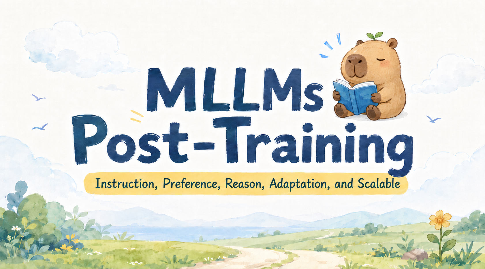

> A rigorous and systematically organized survey repository on post-training methodologies for **Multimodal Large Language Models (MLLMs)**, covering instruction tuning, alignment learning, reasoning enhancement, domain adaptation, scalable training, and multimodal evaluation.

This repository accompanies the survey **A Survey on Post-training of Multimodal Large Language Models** and provides a structured literature map for understanding how post-training transforms pre-trained MLLMs into aligned, capable, and safe multimodal assistants. Following the survey's behavior-shaping perspective, MLLM post-training is not merely a downstream optimization stage; it is a systematic process that calibrates broad cross-modal representations toward reliable instruction following, preference alignment, complex reasoning, domain-aware adaptation, and scalable multimodal learning.

<p align="center">
  
</p>

---

## &#128204; Contents

| Section | Subsection |
| --- | --- |
| [&#129302; Multimodal Instruction Tuning](#multimodal-instruction-tuning) | [Representative Papers](#multimodal-instruction-tuning-papers) |
| [&#127942; Multimodal Alignment Learning](#multimodal-alignment-learning) | [Multimodal RLHF](#multimodal-rlhf), [Multimodal RLAIF](#multimodal-rlaif), [Multimodal Direct Preference Optimization](#multimodal-direct-preference-optimization) |
| [&#128640; Multimodal Reasoning Enhancement](#multimodal-reasoning-enhancement) | [R1-based Multimodal Reasoning](#r1-based-multimodal-reasoning), [Thinking with Images](#thinking-with-images), [Multimodal Self-Evolving](#multimodal-self-evolving), [Multimodal Distillation](#multimodal-distillation) |
| [&#129517; Multimodal Domain Adaptation](#multimodal-domain-adaptation) | [Domain-oriented post-training for specialized multimodal scenarios](#multimodal-domain-adaptation) |
| [&#9881;&#65039; Multimodal Scalable Training](#multimodal-scalable-training) | [LoRA-based Methods](#lora-based-methods), [MoE-based Methods](#moe-based-methods), [Compute-efficient Methods](#compute-efficient-methods) |
| [&#128202; Multimodal Benchmarks](#multimodal-benchmarks) | [Instruction Tuning Benchmarks](#instruction-tuning-benchmarks), [Alignment Learning Benchmarks](#alignment-learning-benchmarks), [Reasoning Enhancement Benchmarks](#reasoning-enhancement-benchmarks), [Domain Adaptation Benchmarks](#domain-adaptation-benchmarks) |

---

# &#128214; Papers

<a id="multimodal-instruction-tuning"></a>
## &#129302; Multimodal Instruction Tuning

Multimodal instruction tuning constitutes one of the earliest and most fundamental post-training paradigms for MLLMs. Its primary objective is to transform broad visual-language representations into instruction-following behavior by training on multimodal instruction-response data. This paradigm establishes the interface between user intent, multimodal input, and model output, thereby enabling MLLMs to respond to image-, video-, audio-, or interleaved multimodal prompts in a task-oriented manner.

The development of this line of research begins with representative systems such as LLaVA, MiniGPT-4, InstructBLIP, and mPLUG-Owl, which demonstrate the effectiveness of combining a visual encoder, a large language model, and curated instruction data. Subsequent studies extend this recipe toward higher-resolution perception, multi-image and video understanding, mobile deployment, visual prompt comprehension, data selection, mixture-of-experts adaptation, and generalized multimodal task transfer.

<a id="multimodal-instruction-tuning-papers"></a>
### Multimodal Instruction Tuning Papers

* **Visual Instruction Tuning** [NeurIPS 2023] [[Paper](https://arxiv.org/pdf/2304.08485)] [[Code](https://github.com/haotian-liu/LLaVA)] [[Homepage](https://llava-vl.github.io/)] <br>
University of Wisconsin–Madison, Microsoft Research, Columbia University

* **MiniGPT-4: Enhancing Vision-Language Understanding with Advanced Large Language Models** [ICLR 2024] [[Paper](https://arxiv.org/pdf/2304.10592)] [[Code](https://github.com/Vision-CAIR/MiniGPT-4)] [[Homepage](https://minigpt-4.github.io/)] <br>
King Abdullah University of Science and Technology

* **InstructBLIP: Towards General-purpose Vision-Language Models with Instruction Tuning** [NeurIPS 2023] [[Paper](https://arxiv.org/pdf/2305.06500)] [[Code](https://github.com/salesforce/LAVIS/tree/main/projects/instructblip)] <br>
Salesforce Research, Hong Kong University of Science and Technology, Nanyang Technological University, Singapore

* **mPLUG-Owl: Modularization Empowers Large Language Models with Multimodality** [arXiv 2023] [[Paper](https://arxiv.org/pdf/2304.14178)] [[Code](https://github.com/X-PLUG/mPLUG-Owl)] <br>
DAMO Academy, Alibaba Group

* **LLaMA-Adapter V2: Parameter-Efficient Visual Instruction Model** [arXiv 2023] [[Paper](https://arxiv.org/pdf/2304.15010)] [[Code](https://github.com/OpenGVLab/LLaMA-Adapter)] <br>
Shanghai Artificial Intelligence Laboratory, CUHK MMLab, Rutgers University

* **Improved Baselines with Visual Instruction Tuning** [CVPR 2024] [[Paper](https://arxiv.org/pdf/2310.03744)] [[Code](https://github.com/haotian-liu/LLaVA)] [[Homepage](https://llava-vl.github.io/)] <br>
University of Wisconsin–Madison, Microsoft Research, Redmond

* **Qwen-VL: A Versatile Vision-Language Model for Understanding, Localization, Text Reading, and Beyond** [arXiv 2023] [[Paper](https://arxiv.org/pdf/2308.12966)] [[Code](https://github.com/QwenLM/Qwen-VL)] <br>
Alibaba Group

* **CogVLM: Visual Expert for Pretrained Language Models** [NeurIPS 2024] [[Paper](https://arxiv.org/pdf/2311.03079)] [[Code](https://github.com/THUDM/CogVLM)] <br>
Tsinghua University, Zhipu AI

* **InternVL: Scaling up Vision Foundation Models and Aligning for Generic Visual-Linguistic Tasks** [CVPR 2024] [[Paper](https://arxiv.org/pdf/2312.14238)] [[Code](https://github.com/OpenGVLab/InternVL)] <br>
OpenGVLab, Shanghai AI Laboratory, Nanjing University, The University of Hong Kong, The Chinese University of Hong Kong, Tsinghua University, University of Science and Technology of China, SenseTime Research

* **LLaVA-NeXT** [[Code](https://github.com/LLaVA-VL/LLaVA-NeXT)] [[Homepage](https://llava-vl.github.io/blog/2024-01-30-llava-next/)]

* **What matters when building vision-language models?** [NeurIPS 2024] [[Paper](https://arxiv.org/pdf/2405.02246)] [[HF](https://huggingface.co/blog/idefics2)] <br>
Hugging Face, Sorbonne Université

* **Qwen2-VL: Enhancing Vision-Language Model's Perception of the World at Any Resolution** [arXiv 2024] [[Paper](https://arxiv.org/pdf/2409.12191)] [[Code](https://github.com/QwenLM/Qwen2-VL)] <br>
ByteDance, S-Lab, NTU, CUHK, HKUST

* **LLaVA-OneVision: Easy Visual Task Transfer** [TMLR 2025] [[Paper](https://arxiv.org/pdf/2408.03326)] [[Code](https://github.com/LLaVA-VL/LLaVA-NeXT/blob/main/docs/LLaVA_OneVision.md)] [[Homepage](https://llava-vl.github.io/blog/2024-08-05-llava-onevision/)] <br>
ByteDance, S-Lab, NTU, CUHK, HKUST

* **Expanding Performance Boundaries of Open-Source Multimodal Models with Model, Data, and Test-Time Scaling** [arXiv 2024] [[Paper](https://arxiv.org/pdf/2412.05271)] [[Code](https://github.com/OpenGVLab/InternVL)] [[Homepage](https://internvl.github.io/blog/2024-12-05-InternVL-2.5/)] <br>
Shanghai AI Laboratory, SenseTime Research, Tsinghua University, Nanjing University, Fudan University, The Chinese University of Hong Kong, Shanghai Jiao Tong University

* **Qwen2.5-VL Technical Report** [arXiv 2025] [[Paper](https://arxiv.org/pdf/2502.13923)] [[Code](https://github.com/QwenLM/Qwen2.5-VL)] <br>
Alibaba Group

* **VILA: On Pre-training for Visual Language Models** [CVPR 2024] [[Paper](https://arxiv.org/pdf/2312.07533)] [[Code](https://github.com/NVlpdf/VILA)] <br>
NVIDIA, MIT

* **MobileVLM : A Fast, Strong and Open Vision Language Assistant for Mobile Devices** [arXiv 2023] [[Paper](https://arxiv.org/pdf/2312.16886)] [[Code](https://github.com/Meituan-AutoML/MobileVLM)] <br>
Meituan Inc., Zhejiang University, China, Dalian University of Technology, China

* **DeepSeek-VL: Towards Real-World Vision-Language Understanding** [arXiv 2024] [[Paper](https://arxiv.org/pdf/2403.05525)] [[Code](https://github.com/deepseek-ai/DeepSeek-VL)] <br>
DeepSeek-AI

* **Yi: Open Foundation Models by 01.AI** [arXiv 2024] [[Paper](https://arxiv.org/pdf/2403.04652)] [[Code](https://github.com/01-ai/Yi)] [[HF](https://huggingface.co/01-ai/Yi-VL-6B)] <br>
01.AI

* **Cambrian-1: A Fully Open, Vision-Centric Exploration of Multimodal LLMs** [NeurIPS 2024] [[Paper](https://arxiv.org/pdf/2406.16860)] [[Code](https://github.com/cambrian-mllm/cambrian)] [[Homepage](https://cambrian-mllm.github.io/)] <br>
New York University

* **MiniCPM-V: A GPT-4V Level MLLM on Your Phone** [arXiv 2024] [[Paper](https://arxiv.org/pdf/2408.01800)] [[Code](https://github.com/OpenBMB/MiniCPM-V)] [[Homepage](https://huggingface.co/openbmb/MiniCPM-V-2_6)] <br>
OpenBMB

* **Phi-3 Technical Report: A Highly Capable Language Model Locally on Your Phone** [arXiv 2024] [[Paper](https://arxiv.org/pdf/2404.14219)] [[HF](https://huggingface.co/microsoft/Phi-3.5-vision-instruct)] <br>
Microsoft

* **Llama-3.2-Vision-Instruct** [[HF](https://huggingface.co/meta-llama/Llama-3.2-11B-Vision-Instruct)]

* **Molmo and PixMo: Open Weights and Open Data for State-of-the-Art Vision-Language Models** [CVPR 2025] [[Paper](https://arxiv.org/pdf/2409.17146)] [[Code](https://github.com/allenai/molmo)] [[Homepage](https://molmo.allenai.org/)] <br>
Allen Institute for AI, University of Washington

* **Pixtral-12B** [arXiv 2024] [[Paper](https://arxiv.org/pdf/2410.07073)] [[Homepage](https://mistral.ai/news/pixtral-12b)] <br>
Mistral AI

* **Comparison Visual Instruction Tuning** [CVPR 2025 Workshop] [[Paper](https://arxiv.org/pdf/2406.09240)] [[Code](https://github.com/wlin-at/CaD-VI)] [[Homepage](https://wlin-at.github.io/cad_vi)] [[HF](https://huggingface.co/datasets/wlin21at/CaD-Inst)] <br>
ELLIS Unit, LIT AI Lab, Institute for Machine Learning, JKU Linz, Austria, TU Graz ICG, Austria, IBM Research, Israel, Weizmann Institute of Science, Israel, Tel-Aviv University, Israel, NXAI GmbH, Austria, MIT-IBM Watson AI Lab, USA

* **PaliGemma: A versatile 3B VLM for transfer** [arXiv 2024] [[Paper](https://arxiv.org/pdf/2407.07726)] [[HF](https://huggingface.co/google/paligemma-3b-mix-224)] <br>
Google DeepMind

* **Otter: A Multi-Modal Model with In-Context Instruction Tuning** [TPAMI 2025] [[Paper](https://arxiv.org/pdf/2305.03726)] [[Code](https://github.com/Luodian/Otter)] <br>
S-Lab, Nanyang Technological University, Microsoft Research

* **LLaMA-Adapter: Efficient Fine-tuning of Language Models with Zero-init Attention** [ICLR 2024] [[Paper](https://arxiv.org/pdf/2303.16199)] [[Code](https://github.com/OpenGVLab/LLaMA-Adapter)] <br>
Shanghai Artificial Intelligence Laboratory, CUHK MMLab, University of California, Los Angeles, CPII of InnoHK

* **Cheap and Quick: Efficient Vision-Language Instruction Tuning for Large Language Models** [NeurIPS 2023] [[Paper](https://arxiv.org/pdf/2305.15023)] [[Code](https://github.com/luogen1996/LaVIN)] <br>
Key Laboratory of Multimedia Trusted Perception and Efficient Computing, Ministry of Education of China, School of Informatics, Xiamen University, 361005, P.R. China., Institute of Artificial Intelligence, Xiamen University, 361005, P.R. China., Peng Cheng Laboratory, Shenzhen, 518000, China.

* **Valley: Video Assistant with Large Language model Enhanced abilitY** [arXiv 2023] [[Paper](https://arxiv.org/pdf/2306.07207)] [[Code](https://github.com/RupertLuo/Valley)] <br>
ByteDance Inc., Fudan University, East China Normal University

* **NExT-GPT: Any-to-Any Multimodal LLM** [ICML 2024] [[Paper](https://arxiv.org/pdf/2309.05519)] [[Code](https://github.com/NExT-GPT/NExT-GPT)] [[Homepage](https://next-gpt.github.io/)] <br>
National University of Singapore

* **InternVL: Scaling up Vision Foundation Models and Aligning for Generic Visual-Linguistic Tasks** [CVPR 2024] [[Paper](https://arxiv.org/pdf/2312.14238)] [[Code](https://github.com/OpenGVLab/InternVL)] <br>
OpenGVLab, Shanghai AI Laboratory, Nanjing University, The University of Hong Kong, The Chinese University of Hong Kong, Tsinghua University, University of Science and Technology of China, SenseTime Research

* **Generative Visual Instruction Tuning** [arXiv 2024] [[Paper](https://arxiv.org/pdf/2406.11262)] [[Code](https://github.com/jeffhernandez1995/GenLlaVA)] <br>
Rice University, Google DeepMind

* **MLAN: Language-Based Instruction Tuning Preserves and Transfers Knowledge in Multimodal Language Models** [arXiv 2024] [[Paper](https://arxiv.org/pdf/2411.10557)] <br>
Washington University in St. Louis, The University of British Columbia, Google Research, Virginia Tech, University of California, Davis, Sony AI, University of California, Berkeley

* **INST-IT: Boosting Instance Understanding via Explicit Visual Prompt Instruction Tuning** [NeurIPS 2025] [[Paper](https://arxiv.org/pdf/2412.03565)] [[Code](https://github.com/inst-it/inst-it)] [[Homepage](https://inst-it.github.io/)] <br>
Institute of Trustworthy Embodied AI, Fudan University, Shanghai Innovation Institute, Huawei Noah, s Ark Lab

* **Learning to Instruct for Visual Instruction Tuning** [NeurIPS 2025] [[Paper](https://arxiv.org/pdf/2503.22215)] [[Code](https://github.com/Feng-Hong/L2T)] <br>
Cooperative Medianet Innovation Center, Shanghai Jiao Tong University, Microsoft Research Asia, Hong Kong Baptist University, School of Artificial Intelligence, Shanghai Jiao Tong University

* **Visual Compositional Tuning** [ICLR 2026 Workshop] [[Paper](https://arxiv.org/pdf/2504.21850)] [[Code](https://github.com/princetonvisualai/compact)] [[Homepage](https://princetonvisualai.github.io/compact/)] <br>
Princeton University, Meta AI

* **Visual Instruction Bottleneck Tuning** [NeurIPS 2025] [[Paper](https://arxiv.org/pdf/2505.13946)] [[Code](https://github.com/deeplearning-wisc/vittle)] <br>
Department of Computer Sciences, University of Wisconsin–Madison

* **LLaDA-V: Large Language Diffusion Models with Visual Instruction Tuning** [arXiv 2025] [[Paper](https://arxiv.org/pdf/2505.16933)] [[Code](https://ml-gsai.github.io/LLaDA-V-demo/)] [[Homepage](https://ml-gsai.github.io/LLaDA-V-demo/)] <br>
Gaoling School of AI, Renmin University of China, Beijing Key Laboratory of Research on Large Models and Intelligent Governance, Engineering Research Center of Next-Generation Intelligent Search and Recommendation, MOE, Ant Group

* **Less Data, Faster Convergence: Goal-Driven Data Optimization for Multimodal Instruction Tuning** [ECCV 2026] [[Paper](https://arxiv.org/pdf/2603.12478)] [[Code](https://github.com/rujiewu/GDO)] <br>
Peking University, University of Illinois at Urbana-Champaign, National University of Singapore

* **LLaVA-NeXT-Interleave: Tackling Multi-image, Video, and 3D in Large Multimodal Models** [ICLR 2025] [[Paper](https://arxiv.org/pdf/2407.07895)] [[Code](https://github.com/LLaVA-VL/LLaVA-NeXT)] [[Homepage](https://llava-vl.github.io/blog/2024-06-16-llava-next-interleave/)] <br>
ByteDance, HKUST, CUHK, NTU

* **MAVIS: Mathematical Visual Instruction Tuning with an Automatic Data Engine** [ICLR 2025] [[Paper](https://arxiv.org/pdf/2407.08739)] [[Code](https://github.com/ZrrSkywalker/MAVIS)] <br>
CUHK, Peking University, Shanghai AI Laboratory, ByteDance, Oracle

* **MANTIS: Interleaved Multi-Image Instruction Tuning** [TMLR 2024] [[Paper](https://arxiv.org/pdf/2405.01483)] [[Code](https://github.com/OpenGVLab/LLaMA-Adapter/tree/main/imagebind_LLM)] [[Homepage](https://tiger-ai-lab.github.io/Mantis/)] <br>
University of Waterloo, Tsinghua University, Sea AI Lab

* **ImageBind-LLM: Multi-modality Instruction Tuning** [arXiv 2023] [[Paper](https://arxiv.org/pdf/2309.03905)] [[Code](https://github.com/OpenGVLab/LLaMA-Adapter/tree/main/imagebind_LLM)] <br>
Shanghai Artificial Intelligence Laboratory, Shanghai, 200030, China., CUHK MMLab, Hong Kong SAR, 999077, China., vivo AI Lab, Shenzhen, 518000, China.

* **ShareGPT4V: Improving Large Multi-Modal Models with Better Captions** [ECCV 2024] [[Paper](https://arxiv.org/pdf/2311.12793)] [[Code](https://github.com/ShareGPT4Omni/ShareGPT4V)] [[Homepage](https://sharegpt4v.github.io/)] <br>
University of Science and Technology of China, Shanghai AI Laboratory

* **MiniGPT-v2: large language model as a unified interface for vision-language multi-task learning** [arXiv 2023] [[Paper](https://arxiv.org/pdf/2310.09478)] [[Code](https://github.com/Vision-CAIR/MiniGPT-4)] [[Homepage](https://minigpt-v2.github.io/)] <br>
King Abdullah University of Science and Technology (KAUST), Meta AI Research

* **ViP-LLaVA: Making Large Multimodal Models Understand Arbitrary Visual Prompts** [CVPR 2024] [[Paper](https://arxiv.org/pdf/2312.00784)] [[Code](https://github.com/WisconsinAIVision/ViP-LLaVA)] [[Homepage](https://vip-llava.github.io/)] <br>
University of Wisconsin–Madison；Cruise LLC

* **MoAI: Mixture of All Intelligence for Large Language and Vision Models** [ECCV 2024] [[Paper](https://arxiv.org/pdf/2403.07508)] [[Code](https://github.com/ByungKwanLee/MoAI)] <br>
School of Electrical Engineering Korea Advanced Institute of Science and Technology (KAIST)

* **Monkey :ImageResolutionandText Label Are Important Things for Large Multi-modal Models** [CVPR 2024] [[Paper](https://arxiv.org/pdf/2311.06607)] [[Code](https://github.com/Yuliang-Liu/Monkey)] <br>
Huazhong University of Science and Technology, Kingsoft Office

* **Mini-Gemini: Mining the Potential of Multi-modality Vision Language Models** [TPAMI 2026] [[Paper](https://arxiv.org/pdf/2403.18814v1)] [[Code](https://github.com/JIA-Lab-research/MGM)] <br>
The Chinese University of Hong Kong；SmartMore

* **Feast Your Eyes: Mixture-of-Resolution Adaptation for Multimodal Large Language Models** [ICLR 2025] [[Paper](https://arxiv.org/pdf/2403.03003)] [[Code](https://github.com/luogen1996/LLaVA-HR)]

* **SPHINX: The Joint Mixing of Weights, Tasks, and Visual Embeddings for Multi-modal Large Language Models** [arXiv 2023] [[Paper](https://arxiv.org/pdf/2311.07575)] [[Code](https://github.com/Alpha-VLLM/LLaMA2-Accessory)] <br>
Shanghai AI Laboratory；MMLab, CUHK；ShanghaiTech University

---

<a id="multimodal-alignment-learning"></a>
## &#127942; Multimodal Alignment Learning

Multimodal alignment learning aims to make MLLM outputs consistent with human preferences, factual evidence, safety requirements, and cross-modal semantic constraints. Compared with text-only alignment, multimodal alignment must additionally address visual hallucination, fine-grained localization errors, temporal inconsistency in videos, modality conflicts, and heterogeneous feedback granularity. The literature can be organized into three major paradigms: reinforcement learning from human feedback, reinforcement learning from AI feedback, and direct preference optimization.

<a id="multimodal-rlhf"></a>
### Multimodal RLHF

Multimodal RLHF introduces human feedback or human-derived reward signals to guide MLLMs toward more factual, helpful, and preference-aligned behavior. Existing methods construct reward models at different levels of granularity, including pair-level, span-level, step-level, and mixed-level feedback. Optimization procedures such as PPO, DDPO, process reward modeling, best-of-N sampling, reject sampling, and multi-objective reinforcement learning are used to improve alignment over image and video contexts.

* **ALIGNING LARGE MULTIMODAL MODELS WITH FACTUALLY AUGMENTED RLHF** [ACL Findings 2024] [[Paper](https://arxiv.org/pdf/2309.14525)] [[Code](https://github.com/llava-rlhf/LLaVA-RLHF)] [[Homepage](https://llava-rlhf.github.io/)] <br>
UC Berkeley, Carnegie Mellon University, University of Illinois Urbana-Champaign, University of Wisconsin-Madison, University of Massachusetts Amherst, Microsoft Research, MIT-IBM Watson AI Lab

* **RLHF-V: Towards Trustworthy MLLMs via Behavior Alignment from Fine-grained Correctional Human Feedback** [CVPR 2024] [[Paper](https://arxiv.org/pdf/2312.00849)] [[Code](https://github.com/RLHF-V/RLHF-V)] [[Homepage](https://rlhf-v.github.io/)] <br>
Tsinghua University, National University of Singapore

* **VisualPRM: An Effective Process Reward Model for Multimodal Reasoning** [arXiv 2025] [[Paper](https://arxiv.org/pdf/2503.10291)] [[Homepage](https://internvl.github.io/blog/2025-03-13-VisualPRM/)] <br>
Shanghai AI Laboratory, SenseTime Research, Zhejiang University

* **Gemini: A Family of Highly Capable Multimodal Models** [arXiv 2023] [[Paper](https://arxiv.org/pdf/2312.11805)] [[Homepage](https://deepmind.google/technologies/gemini/)] <br>
Google

* **Seed1.5-VL Technical Report** [arXiv 2025] [[Paper](https://arxiv.org/pdf/2505.07062)] [[Code](https://github.com/ByteDance-Seed/Seed1.5-VL)] [[Homepage](https://seed.bytedance.com/en/tech/seed1_5_vl)] <br>
ByteDance Seed

* **MiMo-VL Technical Report** [arXiv 2025] [[Paper](https://arxiv.org/pdf/2506.03569)] [[Code](https://github.com/XiaomiMiMo/MiMo-VL)] <br>
LLM-Core Xiaomi

<a id="multimodal-rlaif"></a>
### Multimodal RLAIF

Multimodal RLAIF reduces the cost and scalability limitations of human feedback by using stronger models, automatic evaluators, or structured AI feedback as supervisory signals. This paradigm is particularly valuable for video understanding, large-scale preference construction, and iterative alignment settings. Representative work explores context-aware reward modeling, open-source AI feedback, preference distillation, and iterative refinement for improving trustworthiness and alignment quality.

* **Tuning Large Multimodal Models for Videos using Reinforcement Learning from AI Feedback** [ACL 2024] [[Paper](https://arxiv.org/pdf/2402.03746)] [[Code](https://github.com/yonseivnl/vlm-rlaif)] [[Homepage](https://dcahn12.github.io/projects/vlm-rlaif/)] <br>
Yonsei University, University of Minnesota, Seoul National University

* **RLAIF-V: Open-Source AI Feedback Leads to Super GPT-4V Trustworthiness** [CVPR 2025] [[Paper](https://arxiv.org/pdf/2405.17220)] [[Code](https://github.com/RLHF-V/RLAIF-V)] <br>
Tsinghua University, Shanghai Qi Zhi Institute, Harbin Institute of Technology, Taobao & Tmall Group of Alibaba, Peng Cheng Laboratory, National University of Singapore

* **Oracle-RLAIF: An Improved Fine-Tuning Framework for Multi-modal Video Models using Reinforcement Learning from Ranking Feedback** [arXiv 2025] [[Paper](https://arxiv.org/abs/2510.02561)] <br>
Stanford University, xAI, Microsoft

<a id="multimodal-direct-preference-optimization"></a>
### Multimodal Direct Preference Optimization

Multimodal Direct Preference Optimization directly optimizes model policies from preference data without relying on an explicitly trained reward model. This family of methods is especially useful for mitigating multimodal hallucination, object-level inconsistency, modality-level conflict, and response-level preference errors. Recent work further extends DPO toward conditional preference objectives, vision-guided preference construction, difficulty-aware sampling, uncertainty-aware exploration, and on-policy data generation.

* **Silkie: Preference Distillation for Large Visual Language Models** [arXiv 2023] [[Paper](https://arxiv.org/pdf/2312.10665)] [[Code](https://github.com/vlf-silkie/VLFeedback)] [[Homepage](https://vlf-silkie.github.io/)] <br>
University of Hong Kong, The Chinese University of Hong Kong, Shenzhen, Peng Cheng Laboratory

* **Direct Preference Optimization of Video Large Multimodal Models from Language Model Reward** [NAACL 2025] [[Paper](https://arxiv.org/pdf/2404.01258)] [[Code](https://github.com/RifleZhang/LLaVA-Hound-DPO)] <br>
CMULTI, Bytedance, UT Austin, Columbia University, NTU

* **ISR-DPO: Aligning Large Multimodal Models for Videos by Iterative Self-Retrospective DPO** [AAAI 2025] [[Paper](https://arxiv.org/pdf/2406.11280)] [[Code](https://github.com/snumprlab/isr-dpo)] [[Homepage](https://dcahn12.github.io/projects/isr-dpo/)] <br>
Seoul National University, Yonsei University, University of Minnesota

* **Beyond Hallucinations: Enhancing LVLMs through Hallucination-Aware Direct Preference Optimization** [arXiv 2023] [[Paper](https://arxiv.org/pdf/2311.16839)] [[Code](https://github.com/opendatalab/HA-DPO)] [[Homepage](https://opendatalab.github.io/HA-DPO/)] <br>
Shanghai AI Laboratory

* **Mitigating Hallucination in Multimodal Large Language Model via Hallucination-targeted Direct Preference Optimization** [arXiv 2024] [[Paper](https://arxiv.org/pdf/2411.10436)] <br>
Key Lab of DEKE, Renmin University of China, Machine Learning Platform Department, Tencent

* **V-DPO: Mitigating Hallucination in Large Vision Language Models via Vision-Guided Direct Preference Optimization** [EMNLP 2024] [[Paper](https://arxiv.org/pdf/2411.02712)] [[Code](https://github.com/YuxiXie/V-DPO)] <br>
National University of Singapore

* **CLIP-DPO: Vision-Language Models as a Source of Preference for Fixing Hallucinations in LVLMs** [ECCV 2024] [[Paper](https://arxiv.org/pdf/2408.10433)] <br>
Samsung AI Center Cambridge, UK, Technical University of Iasi, Romania, Queen Mary University of London, UK

* **Mitigating Hallucinations in Multimodal LLMs via Object-aware Preference Optimization** [BMVC 2025] [[Paper](https://arxiv.org/pdf/2508.20181)] [[Code](https://github.com/aimagelab/CHAIR-DPO)] <br>
University of Modena and Reggio Emilia

* **MDPO: Conditional Preference Optimization for Multimodal Large Language Models** [EMNLP 2024] [[Paper](https://arxiv.org/pdf/2406.11839)] [[Code](https://github.com/luka-group/mDPO)] [[Homepage](https://feiwang96.github.io/mDPO/)] <br>
University of Southern California, Microsoft Research, University of California, Davis

* **PEA-DPO** [[Homepage](https://openreview.net/forum?id=uZ5AmOJKqV)]

* **MoD-DPO: Towards Mitigating Cross-modal Hallucinations in Omni LLMs using Modality Decoupled Preference Optimization** [CVPR 2026] [[Paper](https://arxiv.org/pdf/2603.03192)] [[Homepage](https://mod-dpo.github.io/)] <br>
University of Southern California

* **OMNI DPO: A Preference Optimization Framework to Address Omni-Modal Hallucination** [arXiv 2025] [[Paper](https://arxiv.org/pdf/2509.00723)] <br>
Tsinghua University, Hong Kong University of Science and Technology (Guangzhou), OpenRL, Chongqing University

* **DA-DPO: Cost-efficient Difficulty-aware Preference Optimization for Reducing MLLM Hallucinations** [TMLR 2025] [[Paper](https://arxiv.org/pdf/2601.00623)] [[Code](https://github.com/Artanic30/DA-DPO)] [[Homepage](https://artanic30.github.io/project_pages/DA-DPO/)] <br>
ShanghaiTech University, Lingang Laboratory, Shanghai Engineering Research Center of Intelligent Vision and Imaging

* **Uncertainty-Aware Exploratory Direct Preference Optimization for Multimodal Large Language Models** [arXiv 2026] [[Paper](https://arxiv.org/pdf/2605.04874)] <br>
University of Science and Technology of China

* **Mitigating Hallucinations in Large Vision-Language Models via DPO: On-Policy Data Hold the Key** [CVPR 2025] [[Paper](https://arxiv.org/pdf/2501.09695)] [[Code](https://github.com/zhyang2226/OPA-DPO)] [[Homepage](https://opa-dpo.github.io/)] <br>
The Chinese University of Hong Kong, Microsoft Research Asia, The Chinese University of Hong Kong, Shenzhen Research Institute

* **LPOI: Listwise Preference Optimization for Vision Language Models** [ACL 2025] [[Paper](https://arxiv.org/pdf/2505.21061)] [[Code](https://github.com/fatemehpesaran310/lpoi)] <br>
Seoul National University

---

<a id="multimodal-reasoning-enhancement"></a>
## &#128640; Multimodal Reasoning Enhancement

Multimodal reasoning enhancement focuses on strengthening the ability of MLLMs to solve complex tasks that require visual evidence, symbolic reasoning, spatial-temporal understanding, tool use, grounding, and multi-step inference. This research direction has rapidly expanded with the emergence of R1-style reinforcement learning, visually grounded reasoning, self-evolving training loops, and distillation-based capability transfer.

<a id="r1-based-multimodal-reasoning"></a>
### R1-based Multimodal Reasoning

R1-based multimodal reasoning adapts reinforcement learning strategies inspired by R1-style reasoning models to vision-language and omni-modal settings. These methods typically optimize verifiable objectives such as answer correctness, reasoning format, visual grounding, or process-level reward. By reducing dependence on manually annotated reasoning traces, they provide a scalable route for improving mathematical reasoning, chart understanding, video reasoning, retrieval, and general multimodal problem solving.

* **LMM-R1** [arXiv 2025] [[Paper](https://arxiv.org/abs/2503.07536)]

* **VLM-R1: A Stable and Generalizable R1-style Large Vision-Language Model** [arXiv 2025] [[Paper](https://arxiv.org/abs/2504.07615)] [[Code](https://github.com/om-ai-lab/VLM-R1)] <br>
OM AI Lab

* **Visual-RFT: Visual Reinforcement Fine-Tuning** [ICCV 2025] [[Paper](https://arxiv.org/abs/2503.01785)] [[Code](https://github.com/Liuziyu77/Visual-RFT)] <br>
Shanghai AI Laboratory, The Chinese University of Hong Kong (CUHK)

* **Vision-R1: Incentivizing Reasoning Capability in Multimodal Large Language Models** [ICLR 2026] [[Paper](https://arxiv.org/abs/2503.06749)] [[Code](https://github.com/Osilly/Vision-R1)] <br>
East China Normal University, Xiaohongshu Inc.

* **VideoChat-R1: Enhancing Spatio-Temporal Perception via Reinforcement Fine-Tuning** [arXiv 2025] [[Paper](https://arxiv.org/abs/2504.06958)] [[Code](https://github.com/OpenGVLab/VideoChat-R1)] <br>
Nanjing University, Shanghai AI Laboratory, The Chinese University of Hong Kong, Shenzhen

* **Video-R1: Reinforcing Video Reasoning in MLLMs** [NeurIPS 2025] [[Paper](https://arxiv.org/abs/2503.21776)] [[Code](https://github.com/tulerfeng/Video-R1)] <br>
MMLab, The Chinese University of Hong Kong (CUHK), DataWhale, The Chinese University of Hong Kong, Shenzhen

* **VisualPRM: An Effective Process Reward Model for Multimodal Reasoning** [arXiv 2025] [[Paper](https://arxiv.org/pdf/2503.10291)] [[Homepage](https://internvl.github.io/blog/2025-03-13-VisualPRM/)] <br>
Shanghai AI Laboratory, SenseTime Research, Zhejiang University

* **R1-VL: Learning to Reason with Multimodal Large Language Models via Step-wise Group Relative Policy Optimization** [ICCV 2025] [[Paper](https://arxiv.org/abs/2503.12937)] <br>
Nanyang Technological University (NTU), Nankai University, JD Explore Academy

* **R1-Zero's "Aha Moment" in Visual Reasoning on a 2B Non-SFT Model** [arXiv 2025] [[Paper](https://arxiv.org/abs/2503.05132)] [[Code](https://github.com/turningpoint-ai/VisualThinker-R1-Zero)] <br>
University of California, Los Angeles (UCLA), TurningPoint AI

* **MM-Eureka: Exploring the Frontiers of Multimodal Reasoning with Rule-based Reinforcement Learning** [arXiv 2025] [[Paper](https://arxiv.org/abs/2503.07365)] [[Code](https://github.com/ModalMinds/MM-EUREKA)] [[HF](https://huggingface.co/FanqingM/MM-Eureka-8B)] <br>
Shanghai AI Laboratory, SenseTime, The University of Hong Kong

* **R1-Onevision: Advancing Generalized Multimodal Reasoning through Cross-Modal Formalization** [arXiv 2025] [[Paper](https://arxiv.org/abs/2503.10615)] [[Code](https://github.com/Fancy-MLLM/R1-onevision)] <br>
Alibaba Group

* **R1-Omni: Explainable Omni-Multimodal Emotion Recognition with Reinforcement Learning** [arXiv 2025] [[Paper](https://arxiv.org/abs/2503.05379)] [[Code](https://github.com/HumanMLLM/R1-Omni)] <br>
Alibaba Group, Tongji University

* **Retrv-R1: A Reasoning-Driven MLLM Framework for Universal and Efficient Multimodal Retrieval** [NeurIPS 2025] [[Paper](https://arxiv.org/abs/2510.02745)] [[Code](https://lanyunzhu.site/RetrvR1/)] [[Homepage](https://lanyunzhu.site/RetrvR1/)] <br>
City University of Hong Kong

<a id="thinking-with-images"></a>
### Thinking with Images

Thinking with Images emphasizes explicit use of visual evidence during the reasoning process. Instead of compressing images into implicit context alone, these methods encourage models to reason over regions, points, crops, visual tools, latent visual structures, or grounded intermediate representations. This paradigm is crucial for tasks that require localization, visual planning, fine-grained perception, and tool-augmented multimodal reasoning.

* **GRIT: Teaching MLLMs to Think with Images** [NeurIPS 2025] [[Paper](https://arxiv.org/abs/2505.15879)] [[Code](https://github.com/eric-ai-lab/GRIT)] [[Homepage](https://grounded-reasoning.github.io/)] <br>
University of California, Santa Cruz (UCSC)

* **Point-RFT: Improving Multimodal Reasoning with Visually Grounded Reinforcement Finetuning** [arXiv 2025] [[Paper](https://arxiv.org/abs/2505.19702)] <br>
Harbin Institute of Technology, Microsoft Research

* **OpenThinkIMG: Learning to Think with Images via Visual Tool Reinforcement Learning** [arXiv 2025] [[Paper](https://arxiv.org/abs/2505.08617)] [[Code](https://github.com/OpenThinkIMG/OpenThinkIMG)] [[HF](https://huggingface.co/collections/Warrieryes/openthinkimg)] <br>
Shanghai Jiao Tong University, Microsoft Research, The Chinese University of Hong Kong (CUHK)

* **VisionReasoner: Unified Reasoning-Integrated Visual Perception via Reinforcement Learning** [arXiv 2025] [[Paper](https://arxiv.org/abs/2505.12081)] [[Code](https://github.com/dvlab-research/VisionReasoner)] <br>
The Chinese University of Hong Kong (CUHK), SmartMore

* **DeepEyes: Incentivizing "Thinking with Images" via Reinforcement Learning** [ICLR 2026] [[Paper](https://arxiv.org/abs/2505.14362)] [[Code](https://github.com/Visual-Agent/DeepEyes)] [[HF](https://huggingface.co/ChenShawn/DeepEyes-7B)] <br>
Visual Agent

* **VTool-R1: VLMs Learn to Think with Images via Reinforcement Learning on Multimodal Tool Use** [ICLR 2026] [[Paper](https://arxiv.org/abs/2505.19255)] [[Code](https://github.com/VTOOL-R1/vtool-r1)] [[Homepage](https://vtool-r1.github.io/)] <br>
University of Illinois Urbana-Champaign (UIUC), University of Michigan

* **Visual Planning: Let's Think Only with Images** [ICLR 2026] [[Paper](https://arxiv.org/abs/2505.11409)] [[Code](https://github.com/yix8/VisualPlanning)] <br>
University of Cambridge

* **LanteRn: Latent Visual Structured Reasoning** [arXiv 2026] [[Paper](https://arxiv.org/abs/2603.25629)] [[Code](https://github.com/GuilhermeViveiros/LantErn)] [[HF](https://huggingface.co/AGViveiros/LanteRn-3B-RL)] <br>
Instituto Superior Técnico, TU Darmstadt

<a id="multimodal-self-evolving"></a>
### Multimodal Self-Evolving

Multimodal self-evolving methods study how MLLMs can improve through iterative loops of self-generated data, self-correction, critique, reflection, or unsupervised post-training. Rather than relying exclusively on static supervised datasets, these methods treat the model as both a learner and a data or feedback generator. This closed-loop formulation is particularly relevant for data-scarce, dynamically changing, or open-ended multimodal tasks.

* **VIGC: Visual Instruction Generation and Correction** [AAAI 2024] [[Paper](https://arxiv.org/abs/2308.12714)] [[Code](https://github.com/opendatalab/VIGC)] [[Homepage](https://opendatalab.github.io/VIGC)] <br>
Shanghai AI Laboratory, SenseTime

* **MindGYM: Enhancing Vision-Language Models via Synthetic Self-Challenging Questions** [NeurIPS 2025] [[Paper](https://arxiv.org/abs/2503.09499)] [[Code](https://github.com/modelscope/data-juicer/tree/MindGYM)] <br>
Sun Yat-sen University, Alibaba Group

* **SRPO: Enhancing Multimodal LLM Reasoning via Reflection-Aware Reinforcement Learning** [NeurIPS 2025] [[Paper](https://arxiv.org/abs/2506.01713)] [[Code](https://github.com/SUSTechBruce/SRPO_MLLMs)] [[Homepage](https://srpo.pages.dev/)] <br>
ByteDance Seed

* **LLaVA-Critic: Learning to Evaluate Multimodal Models** [CVPR 2025] [[Paper](https://arxiv.org/pdf/2410.02712)] [[Code](https://github.com/LLaVA-VL/LLaVA-NeXT)] [[Homepage](https://llava-vl.github.io/blog/2024-10-03-llava-critic/)] <br>
University of Maryland, ByteDance

* **MM-UPT: Unsupervised Post-Training for Multi-Modal LLM Reasoning via GRPO** [NeurIPS 2025] [[Paper](https://arxiv.org/abs/2505.22453)] [[Code](https://github.com/waltonfuture/MM-UPT)] [[HF](https://huggingface.co/WaltonFuture/Qwen2.5-VL-7B-MM-UPT-MMR1)] <br>
Shanghai Jiao Tong University, Lehigh University

* **LLaVA-Critic-R1: Your Critic Model is Secretly a Strong Policy Model** [arXiv 2025] [[Paper](https://arxiv.org/abs/2509.00676)] [[Code](https://github.com/LLaVA-VL/LLaVA-NeXT)] <br>
University of Maryland, Microsoft Research

<a id="multimodal-distillation"></a>
### Multimodal Distillation

Multimodal distillation transfers capabilities from stronger teacher models, preference models, or on-policy trajectories into smaller, more efficient, or more specialized student models. Beyond conventional compression, this paradigm also supports capability alignment: the student model is expected to preserve fine-grained visual perception, temporal grounding, multimodal reasoning, and cross-modal response quality. Recent work highlights on-policy distillation as an important mechanism for combining efficiency with robust multimodal capability transfer.

* **LLaVA-KD: A Framework of Distilling Multimodal Large Language Models** [ICCV 2025] [[Paper](https://arxiv.org/abs/2410.16236)] [[Code](https://github.com/Fantasyele/LLaVA-KD)] <br>
Huazhong University of Science and Technology, Tencent Youtu Lab

* **LLAVADI: What Matters For Multimodal Large Language Models Distillation** [arXiv 2024] [[Paper](https://arxiv.org/abs/2407.19409)] <br>
Peking University, Nanyang Technological University, University of California, Merced

* **LLaVA-MoD: Making LLaVA Tiny via MoE Knowledge Distillation** [arXiv 2024] [[Paper](https://arxiv.org/abs/2408.15881)] [[Code](https://github.com/shufangxun/LLaVA-MoD)] <br>
MBZUAI, Alibaba Group, The Chinese University of Hong Kong (CUHK)

* **Video-OPD: Efficient Post-Training of Multimodal Large Language Models for Temporal Video Grounding via On-Policy Distillation** [arXiv 2026] [[Paper](https://arxiv.org/abs/2602.02994)] <br>
Tencent AI Lab

* **X-OPD: Cross-Modal On-Policy Distillation for Capability Alignment in Speech LLMs** [arXiv 2026] [[Paper](https://arxiv.org/abs/2603.24596)] <br>
Kuaishou, Microsoft Research Asia

* **Uni-OPD: Unifying On-Policy Distillation with a Dual-Perspective Recipe** [arXiv 2026] [[Paper](https://arxiv.org/abs/2605.03677)] [[Code](https://github.com/WenjinHou/Uni-OPD)] <br>
Zhejiang University, Alibaba Group

* **Vision-OPD: Learning to See Fine Details for Multimodal LLMs via On-Policy Self-Distillation** [arXiv 2026] [[Paper](https://arxiv.org/abs/2605.18740)] [[Code](https://github.com/VisionOPD/Vision-OPD)] <br>
Institute of Software, Chinese Academy of Sciences

* **VA-OPD: Visual-Advantage On-Policy Distillation for Vision-Language Models** [arXiv 2026] [[Paper](https://arxiv.org/abs/2605.21924)] <br>
Institute of Automation, Chinese Academy of Sciences, Meituan

---

<a id="multimodal-domain-adaptation"></a>
## &#129517; Multimodal Domain Adaptation

Domain adaptation studies how pre-trained MLLMs can be specialized to domains with distinct input distributions, task protocols, and reliability requirements. Unlike general instruction tuning or alignment, domain adaptation often requires the model to absorb domain-specific evidence formats, output structures, action spaces, and evaluation criteria. Representative application domains include graphical user interfaces (GUI), document and chart understanding, high-resolution vision (HRV), medical imaging and clinical reasoning, remote sensing, and food analysis. These methods show that domain adaptation for MLLMs must jointly consider data distribution, visual granularity, task interface, and domain-specific reliability.

* **Mobile-Agent: Autonomous Multi-Modal Mobile Device Agent with Visual Perception** [ICLR 2024 Workshop] [[Paper](https://arxiv.org/pdf/2401.16158)] [[Code](https://github.com/X-PLUG/MobileAgent)] <br>
Beijing Jiaotong University, Alibaba Group

* **GUI-R1: A Generalist R1-Style Vision-Language Action Model For GUI Agents** [arXiv 2025] [[Paper](https://arxiv.org/abs/2504.10458)] [[Code](https://github.com/Showlab/GUI-R1)]

* **mPLUG-DocOwl 1.5: Unified Structure Learning for OCR-free Document Understanding** [EMNLP 2024] [[Paper](https://arxiv.org/abs/2403.12895)] [[Code](https://github.com/X-PLUG/mPLUG-DocOwl)] <br>
Alibaba Group

* **LLaVA-UHD: an LMMPerceiving Any Aspect Ratio and High-Resolution Images** [arXiv 2024] [[Paper](https://arxiv.org/pdf/2403.11703)] [[Code](https://github.com/thunlp/LLaVA-UHD)] <br>
Ruyi Xu, Yuan Yao, Zonghao Guo, Junbo Cui, Zanlin Ni, Chunjiang Ge, Tat-Seng Chua, Zhiyuan Liu, Maosong Sun, Gao Huang

* **Advancing Multimodal Medical Capabilities of Gemini** [arXiv 2024] [[Paper](https://arxiv.org/abs/2405.03162)]

* **On Domain-Specific Post-Training for Multimodal Large Language Models** [EMNLP 2025 Findings] [[Paper](https://arxiv.org/abs/2411.19930)] [[Code](https://github.com/thunlp/AdaMLLM)] [[Homepage](https://adamllm.github.io/)]

---

<a id="multimodal-scalable-training"></a>
## &#9881;&#65039; Multimodal Scalable Training

This section organizes scalable post-training strategies that improve efficiency, modularity, and computational feasibility when adapting MLLMs across model scales, modalities, data regimes, and deployment constraints. Scalable training encompasses three complementary directions: parameter-efficient adaptation via low-rank updates (LoRA-based), capacity expansion via sparse mixture-of-experts architectures (MoE-based), and compute-efficient visual processing including token compression and long-context optimization.

<a id="lora-based-methods"></a>
### LoRA-based Methods

Low-Rank Adaptation (LoRA) provides a simple and widely used strategy for efficient MLLM post-training. Instead of updating the entire LLM backbone, LoRA-style methods freeze most pretrained parameters and insert lightweight trainable low-rank matrices into selected layers. This is especially attractive for MLLMs because visual instruction tuning, video adaptation, and domain-specific tuning often require repeated adaptation over different data sources. Recent extensions further explore mixture-style routing, continual learning, and multimodal-specific low-rank configurations.

* **LLaVA-MoLE: Sparse Mixture of LoRA Experts for Mitigating Data Conflicts in Instruction Finetuning MLLMs** [arXiv 2024] [[Paper](https://arxiv.org/abs/2401.16160)] [[Code](https://github.com/lingchen03/LLaVA-MoLE)]

* **MixLoRA: Enhancing Large Language Models Fine-Tuning with LoRA-based Mixture of Experts** [arXiv 2024] [[Paper](https://arxiv.org/abs/2404.15159)] [[Code](https://github.com/TencentARC/MixLoRA)]

* **MoKA: Mixture of Kronecker Adapters** [arXiv 2025] [[Paper](https://arxiv.org/abs/2508.03527)] [[Code](https://github.com/ZhangYuanhan-AI/MokA)] [[Homepage](https://moka-ml.github.io/)]

* **LiLoRA**] [[Code](https://github.com/bupt-ai-cv/LiLoRA)]

<a id="moe-based-methods"></a>
### MoE-based Methods

Mixture-of-Experts (MoE) adaptation improves efficiency by activating only a subset of parameters for each input token or task. For MLLMs, MoE is particularly useful because different modalities, domains, and reasoning patterns may require different expert knowledge, while dense activation of all parameters is often unnecessary. Existing methods follow two directions: sparse expert backbones that expand total capacity while keeping activated computation relatively small, and expert extension that adds new experts to pretrained MoE models for new modalities or tasks while preserving the original backbone.

* **MoE-LLaVA: Mixture of Experts for Large Vision-Language Models** [TMM 2025] [[Paper](https://arxiv.org/abs/2401.15947)] [[Code](https://github.com/PKU-YuanGroup/MoE-LLaVA)]

* **MoE-LLaVA-7B** [TMM 2025] [[Paper](https://arxiv.org/abs/2401.15947)] [[Code](https://github.com/PKU-YuanGroup/MoE-LLaVA)]

* **MoExtend: Tuning New Experts for Modality and Task Extension** [ACL SRW 2024] [[Paper](https://arxiv.org/abs/2408.03511)] [[Code](https://github.com/zyx-2000/MoExtend)]

* **Qwen2-VL: Enhancing Vision-Language Model's Perception of the World at Any Resolution** [arXiv 2024] [[Paper](https://arxiv.org/pdf/2409.12191)] [[Code](https://github.com/deepseek-ai/DeepSeek-VL2)] <br>
ByteDance, S-Lab, NTU, CUHK, HKUST

* **Qwen3-Omni Technical Report** [arXiv 2025] [[Paper](https://arxiv.org/abs/2509.17765)] [[Code](https://github.com/QwenLM/Qwen3)]

* **Qwen3-VL Technical Report** [arXiv 2025] [[Paper](https://arxiv.org/pdf/2511.21631)] [[Code](https://github.com/QwenLM/Qwen3-VL)]

* **MiniMax-01: Scaling Foundation Models with Lightning Attention** [arXiv 2025] [[Paper](https://arxiv.org/abs/2501.08313)] [[Code](https://github.com/MiniMaxAI/MiniMax-01)]

* **Seed1.5-VL Technical Report** [arXiv 2025] [[Paper](https://arxiv.org/pdf/2505.07062)] [[Code](https://github.com/ByteDance-Seed/Seed1.5-VL)] [[Homepage](https://seed.bytedance.com/en/tech/seed1_5_vl)] <br>
ByteDance Seed

<a id="compute-efficient-methods"></a>
### Compute-efficient Methods

Compute-efficient post-training addresses the computational cost of visual encoding, token processing, and long-context modeling in MLLMs. High-resolution images, documents, and videos often produce many visual tokens, raising both training and inference costs. This category is organized into three sub-directions: **Efficient Visual Processing (EVP)** preserves fine-grained perception while controlling token growth; **Token Compression (TC)** directly reduces visual tokens passed to the language model; **Long-Context Optimization (LCO)** handles long videos, multi-image inputs, and extended multimodal conversations.

#### Efficient Visual Processing (EVP)

* **LLaVA-UHD: an LMMPerceiving Any Aspect Ratio and High-Resolution Images** [arXiv 2024] [[Paper](https://arxiv.org/pdf/2403.11703)] [[Code](https://github.com/thunlp/LLaVA-UHD)] <br>
Ruyi Xu, Yuan Yao, Zonghao Guo, Junbo Cui, Zanlin Ni, Chunjiang Ge, Tat-Seng Chua, Zhiyuan Liu, Maosong Sun, Gao Huang

* **AdaMLLM / AdaLLaVA**] [[Code](https://github.com/thunlp/AdaMLLM)] [[Homepage](https://adamllm.github.io/)]

* **InternVL2**] [[Code](https://github.com/OpenGVLab/InternVL)]

* **UReader: Universal OCR-free Visually-situated Language Understanding with Multimodal Large Language Model** [EMNLP 2023] [[Paper](https://arxiv.org/abs/2310.05126)] [[Code](https://github.com/LukcyYuan/UReader)] <br>
Alibaba Group

* **Monkey :ImageResolutionandText Label Are Important Things for Large Multi-modal Models** [CVPR 2024] [[Paper](https://arxiv.org/pdf/2311.06607)] [[Code](https://github.com/Yuliang-Liu/Monkey)] <br>
Huazhong University of Science and Technology, Kingsoft Office

#### Token Compression (TC)

* **An Image is Worth 1/2 Tokens After Layer 2: Plug-and-Play Inference Acceleration for Large Vision-Language Models** [ECCV 2024] [[Paper](https://arxiv.org/pdf/2403.06764)] [[Code](https://github.com/pkuliyi2015/FastV)] <br>
National Key Laboratory for Multimedia Information Processing, Peking University, Alibaba Group

* **VisionZip: Longer is Better but Not Necessary in Vision Language Models** [CVPR 2025] [[Paper](https://arxiv.org/abs/2412.04467)] [[Code](https://github.com/pykale/VisionZip)]

* **SparseVLM: Visual Token Sparsification for Efficient Vision-Language Model Inference** [ICML 2025] [[Paper](https://arxiv.org/abs/2410.04417)] [[Code](https://github.com/linhezheng/SparseVLM)]

* **TRIM / VisionTrim**]

* **TokenPacker: Efficient Visual Projector for Multimodal LLM** [IJCV 2025] [[Paper](https://arxiv.org/abs/2407.02392)] [[Code](https://github.com/richard-peng-xia/TokenPacker)]

#### Long-Context Optimization (LCO)

* **BIOSCAN-5M: A Multimodal Dataset for Insect Biodiversity** [NeurIPS 2024] [[Paper](https://arxiv.org/pdf/2406.12723)] [[Code](https://github.com/long-vu/LongVU)] [[Homepage](https://long-vu.github.io/)] <br>
Centre for Biodiversity Genomics, University of Guelph, University of Waterloo, Simon Fraser University, Vector Institute, Institute (Amii), Aalborg University and Pioneer Centre for AI

* **LongVILA: Scaling Long-Context Visual Language Models for Long Videos** [ICLR 2025] [[Paper](https://arxiv.org/abs/2408.10188)] [[Code](https://github.com/NVlabs/LongVILA)] <br>
NVIDIA, MIT

* **Long Context Transfer from Language to Vision** [TMLR 2025] [[Paper](https://arxiv.org/abs/2406.16852)] [[Code](https://github.com/EvolvingLMMs-Lab/LongVA)]

* **IG-VLM**]

* **VideoChat-Flash: Hierarchical Compression for Long-Context Video Modeling** [arXiv 2025] [[Paper](https://arxiv.org/abs/2501.00574)] [[Code](https://github.com/OpenGVLab/VideoChat-Flash)]

---

<a id="multimodal-benchmarks"></a>
## &#128202; Multimodal Benchmarks

Datasets and benchmarks play a central role in MLLM post-training because they define what behaviors are learned, calibrated, and evaluated. Existing resources can be organized according to the post-training behavior they support, including instruction following, alignment learning, reasoning enhancement, and domain adaptation. Each entry is annotated by its primary role: **T** indicates datasets mainly used for training, **E** indicates benchmarks primarily designed for evaluation, and **T+E** indicates datasets containing both training and evaluation splits.

### Instruction Tuning Benchmarks

* **Visual Instruction Tuning** [NeurIPS 2023] [[Paper](https://arxiv.org/pdf/2304.08485)] [[Code](https://github.com/haotian-liu/LLaVA)] [[Data](https://huggingface.co/datasets/liuhaotian/LLaVA-Instruct-150K)] <br>
University of Wisconsin–Madison, Microsoft Research, Columbia University

* **SEED-Bench: Benchmarking Multimodal LLMs with Generative Comprehension** [CVPR 2024] [[Paper](https://arxiv.org/pdf/2307.16125)] [[Code](https://github.com/AILab-CVC/SEED-Bench)] [[Data](https://huggingface.co/datasets/AILab-CVC/SEED-Bench)] <br>
Tencent AI Lab, ARC Lab, Tencent PCG

* **MM-Vet** [ICML 2024] [[Paper](https://arxiv.org/abs/2308.02490)] [[Code](https://github.com/yuweihao/MM-Vet)] [[Data](https://huggingface.co/datasets/zhiqings/MM-Vet)]

* **MMBench: Is Your Multi-modal Model an All-around Player?** [ECCV 2024] [[Paper](https://arxiv.org/abs/2307.06281)] [[Code](https://github.com/open-compass/MMBench)] [[Data](https://huggingface.co/datasets/lmms-lab/MMBench)] <br>
Shanghai AI Laboratory, Nanyang Technological University, The Chinese University of Hong Kong, National University of Singapore, Zhejiang University

* **ShareGPT4V: Improving Large Multi-Modal Models with Better Captions** [ECCV 2024] [[Paper](https://arxiv.org/pdf/2311.12793)] [[Code](https://github.com/ShareGPT4Omni/ShareGPT4V)] [[Data](https://sharegpt4v.github.io/)] <br>
University of Science and Technology of China, Shanghai AI Laboratory

* **MIA-Bench** [ICLR 2025] [[Paper](https://machinelearning.apple.com/research/towards-better-instruction-following)] [[Code](https://github.com/apple/ml-mia-bench)] [[Data](https://huggingface.co/datasets/apple/MIA-Bench)]

* **MM-IFInstruct**] [[Code](https://github.com/ZhangYuanhan-AI/MM-IFInstruct)] [[Data](https://huggingface.co/datasets/zhangyuanhan/MM-IFInstruct)]

* **MME: A Comprehensive Evaluation Benchmark for Multimodal Large Language Models** [NeurIPS 2025] [[Paper](https://arxiv.org/abs/2306.13394)] [[Code](https://github.com/BradyFU/Awesome-Multimodal-Large-Language-Models/tree/Evaluation)] [[Data](https://huggingface.co/datasets/lmms-lab/MME)]

* **VC-IFInstruct**] [[Code](https://github.com/Video-LLaVA/VC-IFInstruct)] [[Data](https://huggingface.co/datasets/Video-LLaVA/VC-IFInstruct)]

**Others:** VQAv2, GQA, OK-VQA, TextVQA, VizWiz, Visual7W, BLINK, MME-RealWorld, M3IT, ShareGPT4Video, VideoMME

### Alignment Learning Benchmarks

* **Evaluating Object Hallucination in Large Vision-Language Models** [EMNLP 2023] [[Paper](https://arxiv.org/pdf/2305.10355)] [[Code](https://github.com/RUCAIBox/POPE)] [[Data](https://huggingface.co/datasets/rucaibox/pope)] <br>
Gaoling School of Artificial Intelligence, Renmin University of China, School of Information, Renmin University of China, Beijing Key Laboratory of Big Data Management and Analysis Methods, Meituan Group

* **ALIGNING LARGE MULTIMODAL MODELS WITH FACTUALLY AUGMENTED RLHF** [ACL Findings 2024] [[Paper](https://arxiv.org/pdf/2309.14525)] [[Code](https://github.com/Shengcao-Cao/MMHal-Bench)] [[Data](https://huggingface.co/datasets/Shengcao/MMHal-Bench)] <br>
UC Berkeley, Carnegie Mellon University, University of Illinois Urbana-Champaign, University of Wisconsin-Madison, University of Massachusetts Amherst, Microsoft Research, MIT-IBM Watson AI Lab

* **AMBER: An LLM-free Multi-dimensional Benchmark for MLLMs Hallucination Evaluation** [arXiv 2023] [[Paper](https://arxiv.org/abs/2311.07397)] [[Code](https://github.com/jesseor101/AMBER)] [[Data](https://huggingface.co/datasets/jesseor101/AMBER)]

* **HallusionBench: An Advanced Diagnostic Suite for Entangled Language Hallucination and Visual Illusion in Large Vision-Language Models** [CVPR 2024] [[Paper](https://arxiv.org/pdf/2310.14566)] [[Code](https://github.com/tianyi-lab/HallusionBench)] [[Data](https://huggingface.co/datasets/tianyi-lab/HallusionBench)] <br>
University of Maryland, College Park

* **ALIGNING LARGE MULTIMODAL MODELS WITH FACTUALLY AUGMENTED RLHF** [ACL Findings 2024] [[Paper](https://arxiv.org/pdf/2309.14525)] [[Code](https://github.com/llava-rlhf/LLaVA-RLHF)] [[Data](https://huggingface.co/datasets/zhiqings/LLaVA-RLHF-Data)] <br>
UC Berkeley, Carnegie Mellon University, University of Illinois Urbana-Champaign, University of Wisconsin-Madison, University of Massachusetts Amherst, Microsoft Research, MIT-IBM Watson AI Lab

* **RLHF-V: Towards Trustworthy MLLMs via Behavior Alignment from Fine-grained Correctional Human Feedback** [CVPR 2024] [[Paper](https://arxiv.org/pdf/2312.00849)] [[Code](https://github.com/RLHF-V/RLHF-V)] [[Data](https://huggingface.co/datasets/OpenGVLab/RLHF-V-Dataset)] <br>
Tsinghua University, National University of Singapore

* **VLGuard**] [[Code](https://github.com/VLGuard/VLGuard)] [[Data](https://huggingface.co/datasets/VLGuard/VLGuard)]

* **SPA-VL**] [[Code](https://github.com/zhiqings/SPA-VL)] [[Data](https://huggingface.co/datasets/zhiqings/SPA-VL)]

* **Lingua-SafetyBench: A Benchmark for Safety Evaluation of Multilingual Vision-Language Models** [arXiv 2026] [[Paper](https://arxiv.org/abs/2601.22737)] [[Code](https://github.com/yuhuayustc/Lingua-SafetyBench)] [[Data](https://huggingface.co/datasets/yuhuayustc/Lingua-SafetyBench)]

**Others:** CHAIR, M-HalDetect, HaELM, MM-SafetyBench, FigStep, JailBreakV-28K, RTVLM

### Reasoning Enhancement Benchmarks

* **Learn to Explain: Multimodal Reasoning via Thought Chains for Science Question Answering** [NeurIPS 2022] [[Paper](https://arxiv.org/pdf/2209.09513)] [[Code](https://github.com/lupantech/ScienceQA)] [[Data](https://huggingface.co/datasets/derek-thomas/ScienceQA)] <br>
University of California, Los Angeles, Arizona State University, Allen Institute for AI

* **GQA** [CVPR 2019] [[Paper](https://arxiv.org/pdf/1902.09506)] [[Code](https://github.com/stanfordnlp/GQA)] [[Data](https://cs.stanford.edu/people/dorarad/gqa/about.html)]

* **MMMU: A Massive Multi-discipline Multimodal Understanding and Reasoning Benchmark for Expert AGI** [CVPR 2024] [[Paper](https://arxiv.org/pdf/2311.16502)] [[Code](https://github.com/MMMU-Benchmark/MMMU)] [[Data](https://huggingface.co/datasets/MMMU/MMMU)] <br>
IN.AI Research, University of Waterloo, The Ohio State University, Carnegie Mellon University, University of Victoria, Princeton University

* **MathVista: Evaluating Mathematical Reasoning of Foundation Models in Visual Contexts** [ICLR 2024] [[Paper](https://arxiv.org/pdf/2310.02255)] [[Code](https://github.com/lupantech/MathVista)] [[Data](https://huggingface.co/datasets/AI4Math/MathVista)] <br>
UCLA, University of Washington, Microsoft Research, Redmond

* **PuzzleBench**] [[Code](https://github.com/lupantech/PuzzleBench)] [[Data](https://huggingface.co/datasets/lupantech/PuzzleBench)]

* **MME-CoT**] [[Code](https://github.com/BradyFU/MME-CoT)] [[Data](https://huggingface.co/datasets/lmms-lab/MME-CoT)]

* **MME-Reasoning**] [[Code](https://github.com/BradyFU/Awesome-Multimodal-Large-Language-Models)] [[Data](https://huggingface.co/datasets/lmms-lab/MME-Reasoning)]

* **A Diagram Is Worth A Dozen Images** [ECCV 2016] [[Paper](https://arxiv.org/pdf/1603.07396)] [[Code](https://github.com/allenai/ai2d)] [[Data](https://prior.allenai.org/projects/diagram-understanding)] <br>
Allen Institute for Artificial Intelligence, University of Washington

**Others:** CLEVR, OlympiadBench, MathVision, MMMU-Pro, PuzzleVQA, GPQA

### Domain Adaptation Benchmarks

* **DocVQA: A Dataset for VQA on Document Images** [WACV 2021] [[Paper](https://arxiv.org/pdf/2007.00398)] [[Code](https://github.com/answer-extraction/DocVQA)] [[Data](https://rrc.cvc.uab.es/?ch=17)] <br>
CVIT, IIIT Hyderabad, India, Computer Vision Center, UAB, Spain

* **ChartX**] [[Code](https://github.com/ChartReasoning/ChartX)] [[Data](https://huggingface.co/datasets/SharkAI/ChartX)]

* **OCRBench**] [[Code](https://github.com/rohitgirdhar/OCRBench)] [[Data](https://huggingface.co/datasets/echo840/OCRBench)]

* **ScreenSpot**] [[Code](https://github.com/StanfordAI4HI/ScreenSpot)] [[Data](https://huggingface.co/datasets/StanfordAI4HI/screenspot)]

* **Mind2Web: Towards a Generalist Agent for the Web** [NeurIPS 2023] [[Paper](https://arxiv.org/pdf/2306.06070)] [[Code](https://github.com/OSU-NLP-Group/Mind2Web)] [[Data](https://huggingface.co/datasets/osunlp/Mind2Web)] <br>
The Ohio State University

* **VQA-RAD**] [[Code](https://github.com/Awenbocc/VQA-Med)] [[Data](https://www.nature.com/articles/sdata2018251)]

* **PathVQA**] [[Code](https://github.com/UCSD-AI4H/PathVQA)] [[Data](https://github.com/UCSD-AI4H/PathVQA)]

**Others:** AndroidControl-Low, AndroidControl-High, GUI-Odyssey, ScreenSpot-Pro, GUI-Act-Web, OmniAct-Web, ChartQA, InfoVQA, TextVQA, ST-VQA

---

## &#129309; Contributing

Contributions are welcome. Please feel free to submit pull requests that add new papers, code repositories, project pages, model checkpoints, datasets, or benchmark resources. To maintain consistency, each entry should include the paper title, paper link, resource links, venue information, and the most appropriate methodological category.

## &#128204; Citation

If this repository or the associated survey is useful for your research, please consider citing the original survey paper and acknowledging this curated paper list.

```bibtex
@article{zhang2026survey,
  title={A Survey on Post-training of Multimodal Large Language Models},
  author={Zhang, Haonan and Cao, Libin and Lai, Wenrui and Yu, Zhaoshu and Zhang, Sihan},
  year={2026}
}
```

## &#128196; License

This repository is intended for academic research and open-source literature organization. Copyright of the listed papers, codebases, datasets, and benchmarks belongs to their respective authors and organizations.
